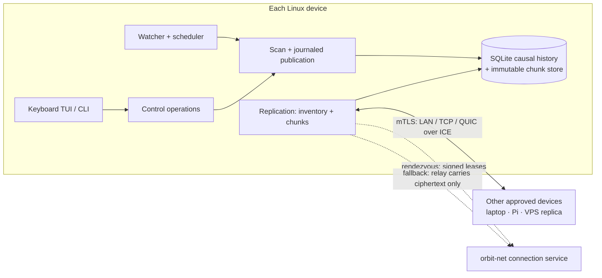

# Orbit

[](https://github.com/calebhabesh/orbit/actions/workflows/ci.yml)
[](LICENSE)

**Peer-to-peer file sync for Linux, with its own sync engine, a keyboard TUI
and cross-network connectivity without a VPN.** Written in Go, with SQLite for
causal history.

## The problem

You edit the same folder on a laptop, a Raspberry Pi and a cloud VM, sometimes
while offline. Most simple sync tools silently keep whichever write arrived
last. Orbit records *why* each version exists, so two edits made
independently are preserved side by side until you choose a resolution, and an
interrupted transfer or crash never leaves a half-written file behind.

## What it does

- **Own sync engine:** causal version history in SQLite, verified 1 MiB chunk
  transfer with resume, explicit conflict review (no silent "last writer
  wins"), and restore of earlier versions.
- **Crash-safe publication:** verified contents are staged and published
  through a durable recovery journal; fault-injection suites cover crashes,
  abrupt VM resets and full disks.
- **Secure by construction:** every device has its own key; peers are pinned
  with mutual TLS and approved with a verification code before they can sync.
- **Works across networks:** direct LAN, TCP or QUIC-over-ICE paths first, an
  encrypted relay as fallback that only ever sees ciphertext, and a small
  operated connection service (`orbit-net`) with signed, expiring profiles.
  Self-hosting is supported.

## Architecture



See the [case study](docs/case-study.md) for module ownership, the conflict
model and the measured tradeoffs.

## Measured results

- **Three hosts:** packaged builds on a Linux laptop, a Raspberry Pi 4B and an
  Oracle Cloud VPS converged to matching contents, with late-arriving
  conflicts preserved ([record](docs/evidence/terminal-t13-20261004/native-engine-final-candidate/three-host.json)).
- **Across networks, no VPN:** home network to an Oracle VPS, a 4 MiB version
  arrived over direct UDP in 6–9 s; with UDP blocked, 1 MB crossed the relay in
  5–8 s each way with zero direct bytes ([runs](docs/evidence/wan-w16-20261006/native-hosted/summary.md)).
- **Bug found only on real networks:** after losing UDP mid-session, the relay
  path never recovered within 180 s; after the fix it recovers in about 5.5 s
  ([fix evidence](docs/evidence/wan-w16-20261006/quota-fix/summary.md)).
- **Failure testing:** 16 abrupt VM-reset cases and five storage-failure cases
  keep protected file hashes intact ([reset](docs/evidence/terminal-t13-20261004/reproduction-final-candidate/clean-release/reset/abrupt-reset.json),
  [disk full](docs/evidence/terminal-t13-20261004/reproduction-final-candidate/clean-release/disk-full/abrupt-reset.json)).
- **Chunk reuse:** a tail edit to a 1 GiB file fetched one 1 MiB chunk and
  reused 1,023. This is one workload, not a general speedup; the
  [measurements](docs/evidence/release-20261001/measured-results.md) also
  record cases where a full-file baseline did better.

Timings come from one home network and one cloud region. School, corporate,
CGNAT and IPv6-only networks were not tested.

## Design boundaries

Orbit provides eventual consistency between trusted replicas. It does not use
consensus, does not merge file contents automatically, and does not protect
data from a peer you have approved. Renames are treated as delete plus create.
The [scope](docs/portfolio-scope.md) lists every exclusion.

Pre-built amd64/arm64 tarballs, `.deb` and `.rpm` packages are on the
[Releases page](https://github.com/calebhabesh/orbit/releases).

## Overview

Orbit is a background Linux file sync daemon with a keyboard interface and
independent CLI commands. Ordinary files stay in local folders. SQLite records
causal history and recovery journals; verified content is retained in a private
content store and transferred over pinned mutual TLS. Concurrent edits require
an explicit review. Stored receipts describe dated observations, not a promise
that an offline device currently has your latest working bytes.

Run `orbit` in a terminal to create or join a folder and manage everyday sync.
Closing it leaves the daemon running. In a pipe, `orbit` prints concise status;
`orbit --json` returns structured status without prompts or terminal escapes.
No browser, GUI runtime, Node or C compiler is required for ordinary operation.
Trusted external editors/diff tools are optional; their bounded invocation uses
util-linux `prlimit`.

```sh
make build build-arm64
./bin/orbit
./bin/orbit status --json
make check
make test-race
make demo
make package
make test-terminal-packages
```

Archives, Debian and RPM packages for amd64/arm64 are written to `dist/`, with
`SHA256SUMS`, dependency notices, the `orbit.service` user unit, a terminal desktop entry,
Bash/Zsh/Fish completions and operator runbooks. Cross builds are not native
Pi execution. [Install and upgrade](docs/runbooks/install.md) explains startup
modes. Low-level engine commands (scan, sync, membership, work, resolve and the
rest) live under `orbit engine`; `orbit engine help` lists them.

Orbit 2.0 completed the rename from the project's original working name,
`file-sync`: binary, packages, service unit (`orbit.service`), state directory
(`~/.local/state/orbit`), scratch directories (`.orbit-internal`) and protocol
domain strings all use `orbit`. 2.0 cannot read 1.x state or sync with 1.x
peers; reinstall and set up again. Historical evidence under `docs/evidence/`
keeps the commands as they were run.
`orbit legacy-browser` (retained alias `orbit launch`) explicitly opens the
frozen browser compatibility interface; keep its bootstrap URL private.

Devices on different networks pair and sync with no VPN, port forwarding or
typed address. The default Automatic mode uses a preconfigured Orbit connection
service to find peers, prefers direct LAN, TCP or QUIC/UDP paths, and falls back
to an encrypted relay that cannot read your files. Local-only, manual/private
network (LAN, Tailscale, WireGuard) and self-hosted modes are explicit
alternatives. The [networking guide](docs/runbooks/networking.md) lists the
networks tested, who runs the service, what it can see, and when its profile
expires.

Use the TUI's Create/Join forms to review existing contents, finite budgets and
the connection service's operator and privacy text. On the inviter, Add device creates
a private invitation; the receiver submits a request, and the owner compares the
exact verification code before approval. Sharing a second folder requires its
own consent and reuses the device key. Keep invitations in private input/files,
never shell arguments or shared transcripts.

```sh
orbit status
orbit folders
orbit devices
orbit conflicts
orbit history notes.txt
orbit deleted
orbit doctor
```

File commands infer the registered folder from the current directory; use
`--folder <name|id>` when needed and `--state <absolute-path>` for multiple
installations. Conflicts and restores require exact current reviews; unavailable
historical bytes cannot be restored. The interface exposes session recovery and
separate-copy restore without silently choosing a conflict winner.

- [Terminal operator guide](docs/runbooks/terminal-operator.md)
- [Keyboard onboarding and sharing](docs/runbooks/terminal-onboarding.md)
- [Conflicts, editor recovery and restore](docs/runbooks/terminal-recovery.md)
- [Connecting across networks](docs/runbooks/networking.md)
- [LAN/Tailscale prerequisites](docs/runbooks/private-network.md)
- [Running the connection service or self-hosting](docs/orbit-net-operator.md)
- [Backup and identity recovery](docs/runbooks/database-recovery.md)
- [Binary rollback](docs/runbooks/rollback.md)
- [Uninstall preserving files/state](docs/runbooks/uninstall.md)

The [combined release record](docs/evidence/wan-w17-20261007/summary.md)
links every WAN and terminal acceptance item to its evidence, including what was
not tested. The [terminal release report](docs/evidence/terminal-t13-20261004/summary.md)
records native journeys, resource measurements, failures and remaining checks.
The [case study](docs/case-study.md) explains the design and measured tradeoffs;
[portfolio bullets](docs/portfolio-bullets.md) link concrete supporting evidence.
Commit IDs cited in evidence before 2026-10-07 are translated in the [publication record](docs/publication-2026-10-07.md). Historical P/O evidence remains dated. Owner personal use and explanation are
not requirements (removed 2026-10-07) and are not claimed. The [scope](docs/portfolio-scope.md),
[protocol](docs/protocol.md), [persistence](docs/persistence.md),
[operations](docs/operations.md) and [verification](docs/verification.md)
own the guarantees and failure model.
