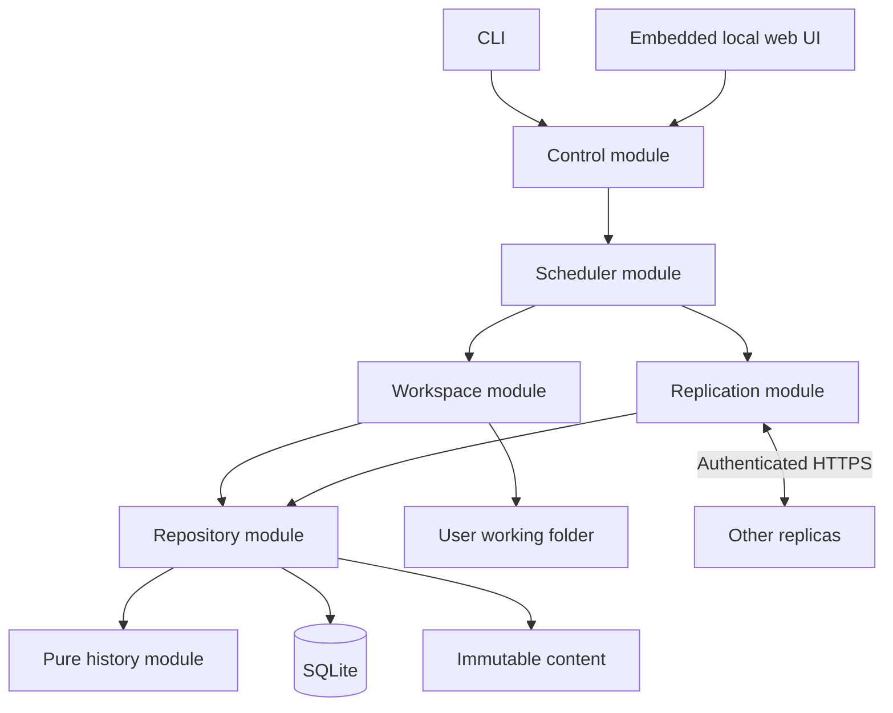

# Architecture baseline

Status: design baseline; gates in P01 must validate the difficult seams before dependent production code. Product requirements live in [scope](portfolio-scope.md).

## Shape

One Go process per device contains the engine, peer listener, local control listener, and background scheduler. SQLite and managed content are local to that process. CLI commands are control clients; the browser uses the same control operations. No independent frontend server is required at runtime.



These arrows show allowed responsibility flow, not a requirement that every operation pass through the scheduler. Control may query repository views directly. History never imports networking, filesystem, wall-clock, SQL, or UI code.

## Deep modules and interfaces

| Module | Small public operations (conceptual) | Hidden complexity |
| --- | --- | --- |
| History | ValidateVersion, Compare, Heads, PlanResolution | Causal ancestry, duplicate identity, conflicts, deterministic ordering |
| Repository | Capture, ImportMetadata, StoreContent, Snapshot, PreparePublication, CompletePublication, Collect | SQL transactions, counters, object pins, journals, durable receipts, retention |
| Workspace | Scan, PlanApply, Apply, Recover | Stable reads, root/path validation, structural collisions, same-filesystem staging, flush ordering |
| Replication | ReconcilePeer, FetchVersion, ServePeer | Wire validation, paging, authorization, retries, chunk reuse, peer progress |
| Scheduler | Submit, Pause, Resume, Shutdown | Durable work, fairness, bounded resources, retry backoff, cancellation |
| Control | Enroll, Scan, Sync, Resolve, Restore, Status and lifecycle operations | Input validation, idempotency, stale-view tokens, operation status |

Names are illustrative, not a mandate to create one interface per row. Define interfaces only where production and a meaningful test adapter vary. Expose typed results such as `NeedsContent`, `Conflict`, `StaleView`, and `RootUnavailable`; callers must not sequence raw SQL, chunk writes, and filesystem swaps themselves.

## Proposed source layout

```text
cmd/filesync/                entry point and CLI client
internal/history/            pure causal rules
internal/repository/         metadata, content store, durable journals and GC
internal/workspace/          scanning, root operations, publication and recovery
internal/replication/        peer sessions, wire handlers and transfer
internal/scheduler/          background work and resource budgets
internal/control/            local commands, queries and authentication
internal/config/             validated persistent configuration
internal/testkit/            disposable environments and fault-hook adapters
web/                        embedded React/TypeScript/Vite interface
model/                      independent test-only causal model
schemas/                    wire/control schema and fixtures
migrations/                 versioned database migrations
scripts/                    local demo, packaging and evidence runners
tests/integration/           actual multi-process scenarios
tests/faults/                deterministic failure schedules
docs/evidence/              reproducible results, created as checks run
```

Keep package count modest. Do not split every noun into a package or build an abstract storage framework. The reference model must not import production causal algorithms.

## Storage records and ownership

Repository schema design must include these logical records; migrations determine physical tables/indexes in P03.

| Record | Identity and purpose |
| --- | --- |
| Device identity / actor counter | Persistent identity and next monotonic event counter per shared folder |
| Folder / membership revision | Stable folder identity, root registration and locally approved membership configuration |
| Version envelope | Immutable folder, path, author/counter, parents/vector, kind and content descriptor |
| Content manifest / chunk | Ordered hashes and lengths; local verification/availability and physical storage |
| Path projection | Known heads, working basis, last captured observation, publication generation and block reason |
| Transfer / pin | Required chunks, verified progress, reservations, cancellation and object protection |
| Publication journal | Intended version, prior basis, staging/recovery paths and durable transition state |
| Peer progress | Direct receipts, locally observed remote status, contact time and inventory cursor |
| Retention / GC intent | Local retention eligibility, durable roots/pins, quarantined objects and pending deletion |
| Control operation | Idempotency key, request fingerprint, expected generation, result and replay lifetime |

Index versions by folder/path and author/counter; enforce uniqueness in the database. Foreign keys and integrity checks are required. Counter allocation and version metadata commit together; immutable content is durable first. Imported counters never advance local author identity.

## Concurrency ownership

- One agent exclusively owns its state directory and registered roots. A second agent refuses startup rather than sharing SQLite or competing over publication.
- Serialize mutations within each folder initially. Hashing, chunk IO and network work run outside the metadata transaction under bounded workers; completion revalidates the captured generation.
- Serialize application to overlapping paths/subtrees. A parent deletion and child creation cannot publish independently without structural revalidation.
- Do not hold SQLite write transactions across network calls or long file reads.
- Use contexts for cancellation and bounded worker lifetimes. Persist restart-worthy work; do not persist every transient scheduler tick.
- A notification schedules observation; it is not evidence that a filesystem operation completed or an authoritative deletion log.

Optimize beyond these rules only after profiling and preserving model equivalence. Start with a serialized writer; parallel SQL mutation is not a portfolio requirement.

## Data flow

Local capture: root verified → file opened safely → bytes read and hashed to immutable objects → stable-read checks → durable objects → atomic version/counter commit → inventory eligible for publication.

Remote receipt: authorized inventory → validated immutable envelope → acquire pinned missing chunks → verify complete file → durable readiness commit → direct durable receipt → reconcile/application work. Metadata knowledge can precede content readiness; it must not imply successful publication or permit premature deletion of protected old content.

Remote application: prepare recoverable intent → preserve observed competing local content → stage verified bytes on root filesystem → perform validated publication transition → flush required filesystem state → commit applied basis → report status. Exact supported race behavior is gated in P01/P04 and specified in [persistence](persistence.md).

## Design gates

P01 closed D1–D5 with the executable outcomes in
[design-gates](design-gates.md). The table remains the dependency map; later
packets must implement and revalidate those contracts at their production
fault boundaries.

| Gate | Required experiment and decision | Blocks |
| --- | --- | --- |
| D1 | Linux publication prototype: overwrite/rename editors, open descriptors, symlink swaps, crash at each transition; document supported writer model and recovery outcomes | P04 and any automatic replacement |
| D2 | Three-actor model of working basis, explicit resolution, same-author stale basis and equal bytes; reject implicit conflict resolution | P02/P07 |
| D3 | Membership revision/retirement model: old epoch forwarding, lost device, stale configuration, no resurrection, safe bootstrap | P09 and membership-dependent cleanup |
| D4 | Content-reference model: retention expiry vs heads, offline peers, in-flight fetches, pending publication and interrupted GC | P10 |
| D5 | Directory/child and initial-enrollment model: empty directories, delete/create collision, unavailable root, conflicting initial contents | P04/P07/P09 |

Each outcome must include a counterexample attempted, executable evidence, chosen contract, and limitations. Engineering defaults may change; approved user guarantees may not silently weaken.
