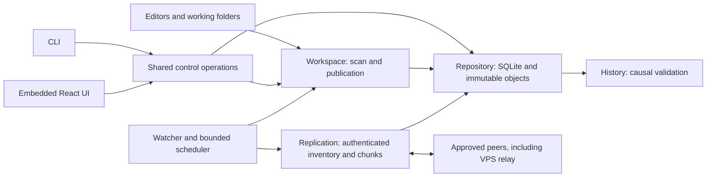

# File Sync: causal history and release evidence

File Sync lets one owner edit selected folders on trusted Linux devices,
including a Raspberry Pi and an always-on VPS. It records immutable versions
and keeps independently captured edits until the owner reviews a resolution.
The VPS stores and forwards versions; it cannot choose a conflict winner.
Replicas hold plaintext, and pinned mutual TLS authenticates transfers.

## Module ownership

Causal history belongs to `internal/history`; repository transactions allocate
folder-wide author counters. Workspace publication uses descriptor-rooted
filesystem operations, staged verified contents, exchange/no-replace renames,
and a durable recovery journal. CLI and UI call the same control operations.
The independent model uses explicit parent reachability rather than the
production vector comparison.

## Conflict and restore example

A and B capture edits based on the same earlier note while offline. Neither
edit dominates the other, so reconnecting preserves two heads. A reviewed
selection creates a new version with both heads as parents. If C's previously
unseen edit arrives afterwards, it remains concurrent with that resolution.
A stale token is rejected; choosing again requires reviewing the new heads.
Restore uses historical bytes with the current reviewed heads as parents,
creating a new version rather than rolling back history or counters.

The [actual-host results](evidence/release-20261001/workstation-demo-final/three-host.json)
record three-head agreement, late-arrival conflict preservation, stale-request
rejection, forwarding with the author listener stopped, and historical restore.
These are scripted checks on a workstation, Pi and VPS. The prescribed laptop
was unreachable through its configured SSH address, and owner personal use is
still a release gate.

## Recovery evidence

Process-fault tests stop real helper processes before/after named durable
boundaries and reopen the repository. They establish the tested process
recovery outcomes, while kernel caches remain alive.

The [VM campaign](evidence/release-20261001/reset/abrupt-reset.json) instead
stops a dedicated QEMU/KVM instance at production hooks and boots a fresh guest
on its disposable ext4 disk. An unflushed overwrite is lost in the negative
control; protected content remains hash-valid and publication recovery
completes at the selected boundaries. Successful flushes and the recorded
virtual block-device behavior are assumptions. Host power loss, broken flush
promises, arbitrary descriptor-held editor writes and physical Pi media resets
are outside this experiment.

The earlier file-readback/orderly-reopen test has been renamed
`TestP16StorageBarrierSmoke`. It supports ordinary IO assertions, not resets.

## Storage tradeoffs

Accepted causal metadata remains available even when policy makes superseded
payloads eligible for expiry. Current heads, unresolved conflicts, pending
publication fallback, retained history, explicit pins, active operations and
recovery candidates protect content. GC uses coordinated intents and reference
checks around unlink and finalization. An offline device is never silently
retired. Historical payload availability can differ across replicas; a receipt
records past durable storage, not permanent availability.

Fixed 1 MiB chunks keep transfer and verification simple. An in-place edit can
reuse unchanged chunks; prefix insertion shifts boundaries and can require
nearly all contents again. Content-defined chunking remains outside v1 scope.

## A release experiment found product defects

The earlier benchmark estimated bytes and used a discard-only plain HTTP
baseline. Its advertised percentages are withdrawn. The replacement counts
actual TLS/TCP streams and compares against a mutual-TLS full-file receiver
that verifies, flushes, and publishes files. An unchanged baseline hashes and
skips identical contents, so unchanged-tree savings must be measured honestly.

A 1,000-file hierarchy exposed a total-inventory rejection at 1,024 versions.
The regression `TestSyncInventoryLargerThanMemoryQueue` went red on that actual
limit. Inventories now stream into a quota-checked temporary spool; per-fetch
ancestry remains bounded, expired snapshots restart safely, and explicit
server backpressure has bounded retries. Completed sender snapshots release
capacity after successful iteration. Transport delivery remains replay-safe.

The 10,000-file scan then exposed repeated folder-wide history reconstruction
for per-path captures/status. A CPU profile confirmed the database/history work.
These operations now load only the path's history. Immutable ID checks remain
folder-wide, including known rollback-counter collisions, while structural and
GC operations still inspect the folder.

A local 1,000-directory capture microbenchmark measured 14.402 seconds before
and 0.104 seconds afterwards (one sample each). See the
[before](evidence/release-20261001/history-profile-before.log) and
[after](evidence/release-20261001/history-profile-after.log) logs. This is a
narrow regression measurement, not a general synchronization speedup claim.
The raw synthetic campaigns are linked in the [release report](evidence/release-20261001/summary.md).

Native user-service experiments also found a default-state path mismatch and
a standalone system-install binary-path mismatch. Both were fixed. The
[executed lifecycle checks](evidence/release-20261001/lifecycle/service-lifecycle.json)
cover service restart, embedded UI delivery without Node, and state/root
preservation on three reachable native hosts.

## Attribution and ownership

[Syncthing BEP](https://docs.syncthing.net/specs/bep-v1.html) informs the
separation of vectors, inventory and transfer blocks. The
[SQLite WAL documentation](https://www.sqlite.org/wal.html) informs local
transaction/flush assumptions. [Linux rename semantics](https://man7.org/linux/man-pages/man2/rename.2.html)
explain why exchange preserves the displaced inode but cannot bound a writer
that retains its old descriptor. File Sync implements its own sync engine and
does not claim Syncthing compatibility or inherit another project's correctness.

The owner selected the approved scope and architecture and must still perform
and explain the real personal-use pilot. AI-assisted implementation/testing is
not evidence of owner understanding or adoption. Evidence-backed portfolio
claims can describe the causal model, verified chunk resume, scoped process/VM
recovery and measured workloads; they cannot yet say all release requirements
are complete.
