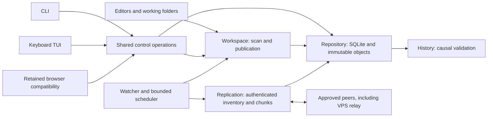

# Orbit: conflict-aware Linux file synchronization

Orbit lets one owner edit selected folders on trusted Linux devices,
including a Raspberry Pi and an always-on VPS. It records immutable versions
and keeps independently captured edits until the owner reviews a resolution.
The VPS stores and forwards versions; it cannot choose a conflict winner.
Replicas hold plaintext, and pinned mutual TLS authenticates transfers.
Since the native WAN expansion, devices on different networks pair and sync
without a VPN: they find each other through a small connection service and
connect directly when they can, or through its encrypted relay when they cannot.

## Module ownership

Causal history belongs to `internal/history`; repository transactions allocate
folder-wide author counters. Workspace publication uses descriptor-rooted
filesystem operations, staged verified contents, exchange/no-replace renames,
and a durable recovery journal. CLI and UI call the same control operations.
The independent model uses explicit parent reachability rather than the
production vector comparison.

## Conflict and restore example

A and B capture edits based on the same earlier note while offline. Neither
edit dominates the other, so reconnecting preserves two heads. A reviewed
selection creates a new version with both heads as parents. If C's previously
unseen edit arrives afterwards, it remains concurrent with that resolution.
A stale token is rejected; choosing again requires reviewing the new heads.
Restore uses historical bytes with the current reviewed heads as parents,
creating a new version rather than rolling back history or counters.

The [packaged actual-host results](evidence/terminal-t13-20261004/native-engine-final-candidate/three-host.json)
record three-head agreement, late-arrival conflict preservation, stale-request
rejection, forwarding with the author listener stopped, and historical restore.
These are scripted checks on the actual laptop, Pi and Oracle VPS using
binaries extracted from verified packages. The receiving process was actually
stopped mid-file; restart reused durable chunks and verified the whole hash.
Owner personal use was not measured; the owner removed it as a requirement on 2026-10-07.

## Native WAN: two roles that are easy to confuse

The Oracle VPS plays two separate roles, and the design depends on keeping them
apart.

| | VPS **replica** (an Orbit device) | **`orbit-net`** connection service |
| --- | --- | --- |
| Runs | The ordinary Orbit daemon with its own identity | A separate operator binary and systemd unit |
| Holds | Plaintext folder contents, history, receipts | Short-lived signed directory entries in memory |
| Moves data by | Storing versions and forwarding them later, even while the author is offline | Relaying an inner TLS stream between two online devices in real time |
| Can read files | Yes; it is an approved member | No; it relays ciphertext between pinned device keys |
| Decides conflicts | Never; it keeps every head | Never sees versions at all |

Replication is unchanged. A connection manager under it chooses the route, and
every route carries the same pinned mutual TLS. Routes are tried in order: LAN,
reachable TCP/IPv6, QUIC over a UDP path found by ICE/STUN, then a WebSocket
relay. Devices register and look each other up with signed short-lived leases. A
release profile names the service. It is signed by an authority key that is
kept off the server and shipped inside every build, so ordinary setup needs no
addresses or profile files. Pairing still requires an invitation, a matching
verification code and explicit approval. The service never authorizes folder
access.

Tradeoffs: there is no TURN, UPnP or router port mapping. When no direct path
exists, all traffic goes through one budgeted relay (4 MiB/s in total for the
hosted service). Devices meet only through a shared operator. A device whose
address changes waits for the service to drop its old control channel, about
30 s. Shortening that would need a server-side change.

Native testing found defects that local tests had missed:

- **Profile rotation stranded every pairing (W13).** Routes kept the old
  epoch's digest, so peers rejected each other's proofs. A strict-digest
  reproduction failed the mixed-epoch transfer before the fix and passed after.
- **The VPS cannot bind its public address (W13).** Under Oracle's 1:1 NAT,
  STUN must bind the private address and report the public one (`stun_bind`).
  This was found by review before the first production start.
- **Refused announcements starved quotas (W15).** Repeated refused announcement
  generations led to stale offers and quota starvation; the repair is in the W15 campaign.
- **Relay recovery after losing UDP mid-session (W16).** With UDP blocked
  partway through, the reverse direction never recovered within 180 s, which
  reproduced twice. Signed service operations were consuming the per-device
  budget, and both directions shared a two-tunnel limit. The fix paces signed
  operations with a reserve for renewals, admits a whole relay setup at once,
  rebuilds control on network change and keeps one initiator tunnel per
  direction. Three later runs recovered in about 5.5 s with zero quota
  refusals.
- **The packaged service could not be enabled (W17).** After the packaged
  per-user install, `orbit service enable` refused the unit, because the unit
  names its state with systemd's `%h` and Orbit compared the path literally.
  `service start` also reported a daemon launched by setup as the service,
  while the real unit crash-looped on the state lock. The fix expands `%h`,
  requires the unit's `MainPID` to own the state, and refuses with
  `MANUAL_DAEMON_RUNNING` otherwise. A disposable KVM guest then passed login,
  logout and unattended-boot checks.

Measured on one home fibre network and one Oracle region, with packaged builds
and the live hosted service ([W16 record](evidence/wan-w16-20261006/native-hosted/summary.md)):

| Observation | Result (single runs) |
| --- | --- |
| Join to approved, CLI or keyboard TUI | 31–35 s |
| 4 MiB version, home NAT → VPS | 6.1–8.4 s over direct UDP (about 1.1 MB after chunk reuse) |
| 1 MB with UDP blocked, each direction | 5.0–7.8 s over the relay, zero direct bytes |
| First transfer after an address change | 21.5–40.0 s |
| Relay ready after a service restart | 9.5 s |
| Three devices: forwarding, conflict, restore | 7.8 s / 13.7 s to identical heads / 10.2 s |
| Daemon memory on Pi, VPS and laptop | 30–36 MiB RSS; `orbit-net` about 15 MiB |

School, corporate, CGNAT and IPv6-only networks were not available and are not
claimed. The laptop shared the Pi's home network, so the three-device run shows
engine behaviour over the service, not a third network. Supported networks,
privacy text and alternatives are in the
[networking guide](runbooks/networking.md).

## Recovery evidence

Process-fault tests stop real helper processes before/after named durable
boundaries and reopen the repository. They establish the tested process
recovery outcomes, while kernel caches remain alive.

The [clean-snapshot VM campaign](evidence/terminal-t13-20261004/reproduction-final-candidate/clean-release/reset/abrupt-reset.json) instead
stops a dedicated QEMU/KVM instance at production hooks and boots a fresh guest
on its disposable ext4 disk. An unflushed overwrite is lost in the negative
control; protected content remains hash-valid and publication recovery
completes at the selected boundaries. Successful flushes and the recorded
virtual block-device behavior are assumptions. Host power loss, broken flush
promises, arbitrary descriptor-held editor writes and physical Pi media resets
are outside this experiment.

The same checkout passed four actual disk-exhaustion cases (incoming writes,
SQLite growth, checkpoint allocation and publication staging) plus a separately
labeled fsync/fdatasync error injected into a VM child with seccomp. See the
[storage-failure results](evidence/terminal-t13-20261004/reproduction-final-candidate/clean-release/disk-full/abrupt-reset.json).

The earlier file-readback/orderly-reopen test has been renamed
`TestP16StorageBarrierSmoke`. It supports ordinary IO assertions, not resets.

## Storage tradeoffs

The terminal release campaign found a database failure under actual storage
exhaustion: SQLite's mapped WAL index crashed with SIGBUS before Orbit could
return a storage error. The repository already had one owner and one serialized
connection. Configuring SQLite's private WAL index mode, before any WAL access
including reopen, let the same VM regression return an error and retain protected
content. The driver reordered startup PRAGMAs, so simply adding a locking-mode
setting was insufficient. The [release record](evidence/terminal-t13-20261004/summary.md)
retains that failed experiment and the passing storage/reopen checks.

A 1,024-file terminal fixture also exposed repeated history query preparation and
duplicate readiness calculations. Scoped prepared statements and batched
availability observations reduced a diagnostic readiness sample from 4.121 s to
0.437 s under race instrumentation. This was one sample before/after on a specific
fixture. Resource runs separately sample real CLI processes and verify whole-file
hashes after streamed 8/32-MiB editor merges.

Native keyboard use caught a status bug that local tests had missed: publication
could finish while its durable operation screen stayed pending. Queries now
observe actual working projections; explicit retry keeps the same operation and
version IDs. A second regression keeps an automatically paused missing root's
cause visible. Neither UI fix changes conflict winners or protocol history.

Accepted causal metadata remains available even when policy makes superseded
payloads eligible for expiry. Current heads, unresolved conflicts, pending
publication fallback, retained history, explicit pins, active operations and
recovery candidates protect content. GC uses coordinated intents and reference
checks around unlink and finalization. An offline device is never silently
retired. Historical payload availability can differ across replicas; a receipt
records past durable storage, not permanent availability.

Fixed 1 MiB chunks keep transfer and verification simple. An in-place edit can
reuse unchanged chunks; prefix insertion shifts boundaries and can require
nearly all contents again. Content-defined chunking remains outside v1 scope.

## A release experiment found product defects

The earlier benchmark estimated bytes and used a discard-only plain HTTP
baseline. Its advertised percentages are withdrawn. The replacement counts
actual TLS/TCP streams and compares against a mutual-TLS full-file receiver
that verifies, flushes, and publishes files. An unchanged baseline hashes and
skips identical contents, so unchanged-tree savings must be measured honestly.

A 1,000-file hierarchy exposed a total-inventory rejection at 1,024 versions.
The regression `TestSyncInventoryLargerThanMemoryQueue` went red on that actual
limit. Inventories now stream into a quota-checked temporary spool; per-fetch
ancestry remains bounded, expired snapshots restart safely, and explicit
server backpressure has bounded retries. Completed sender snapshots release
capacity after successful iteration. Transport delivery remains replay-safe.

The 10,000-file scan then exposed repeated folder-wide history reconstruction
for per-path captures/status. A CPU profile confirmed the database/history work.
These operations now load only the path's history. Immutable ID checks remain
folder-wide, including known rollback-counter collisions, while structural and
GC operations still inspect the folder.

A local 1,000-directory capture microbenchmark measured 14.402 seconds before
and 0.104 seconds afterwards (one sample each). See the
[before](evidence/release-20261001/history-profile-before.log) and
[after](evidence/release-20261001/history-profile-after.log) logs. This is a
narrow regression measurement, not a general synchronization speedup claim.
The raw synthetic campaigns are linked in the [release report](evidence/release-20261001/summary.md).
The [measured results](evidence/release-20261001/measured-results.md) give
workload-specific stream counts, sample sizes, times and accumulated storage.
In the three 100-MiB archive repetitions, a 4-KiB tail overwrite fetched one
chunk and reused 99, reducing TLS/TCP stream bytes by 98.89% (median).
Prefix insertion fetched all 21 chunks of a 20-MiB-plus-one-byte file and used
0.66% more stream bytes than the baseline (median). These are byte comparisons;
they do not establish a general wall-time improvement.

Finite storage budgets exposed another defect: inventory admission traversed
the entire object store for each summary. An unchanged 10,000-file replica
repeatedly exceeded the sender's 30-second snapshot lifetime. Admission now
writes one bounded page per quota check. The same populated fixture then
[completed without expiry](evidence/release-20261001/inventory-page-warm-regression.json).
Per-object budget accounting still traverses storage, and durable per-file
operations remain expensive. Those are measured limitations rather than a
throughput guarantee.

A later full-size transfer exposed contention between chunk workers during
server backpressure. Successful workers kept consuming newly available request
capacity while a throttled worker exhausted its five attempts. The
[controlled regression failed](evidence/release-20261001/chunk-backpressure-before.log).
Chunk workers now share the sync session's bounded cooldown, allowing capacity
to recover before more requests. The [regression passed after the fix](evidence/release-20261001/chunk-backpressure-after.log),
with cancellation and race checks recorded separately. The accepted final
measurements use the repaired `e13e53a` packages.

The plain-rename design was rejected during publication experiments: an
editor can replace the inode after a pre-rename stat. Exchange keeps the
actually displaced inode named for recovery. It preserves the supported
observed write but cannot promise capture of arbitrary future writes through
a descriptor the editor retains.

Native user-service experiments also found a default-state path mismatch and
a standalone system-install binary-path mismatch. Both were fixed. The
[packaged lifecycle checks](evidence/release-20261001/lifecycle-release-packaged-final/service-lifecycle.json)
cover service restart, embedded UI delivery without Node, and state/root
preservation on three reachable native hosts.

Native Ubuntu capture also exposed a systemd/AppArmor interaction with
filesystem namespace hardening; a running service alone did not prove it could
scan its registered root. The portable unit retains unprivileged ownership,
resource limits and `NoNewPrivileges`, and the lifecycle oracle now requires
an ordinary edit to be captured. Background replication uses persisted peer
endpoints, finite persisted limits and coalesced durable tasks; restart loading
selects active tasks before the queue limit, so old completed history cannot
hide pending work.

## Attribution and ownership

[Syncthing BEP](https://docs.syncthing.net/specs/bep-v1.html) informs the
separation of vectors, inventory and transfer blocks, and Syncthing's
discovery/relay design inspired the setup flow. Orbit is not wire-compatible
with Syncthing and does not aim for feature parity. The
[SQLite WAL documentation](https://www.sqlite.org/wal.html) informs local
transaction/flush assumptions. [Linux rename semantics](https://man7.org/linux/man-pages/man2/rename.2.html)
explain why exchange preserves the displaced inode but cannot bound a writer
that retains its old descriptor. Orbit implements its own sync engine and
does not claim Syncthing compatibility or inherit another project's correctness.

The owner selected the scope and architecture. Implementation and validation
were AI-assisted; automated campaigns establish their recorded technical
outcomes. They do not establish personal adoption or owner review, which are not claimed.
The [terminal release record](evidence/terminal-t13-20261004/summary.md) and the
[combined W17 release record](evidence/wan-w17-20261007/summary.md) track
current native, performance and recovery evidence, including unavailable
network/service scenarios.
