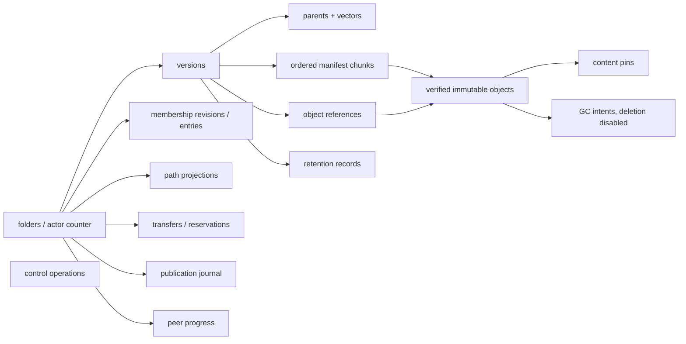

# P03 durable repository evidence

P03 implements schema version 2, immutable SHA-256 chunk storage, streamed
1 MiB manifests, whole-file verification, atomic local version creation,
pending remote admission, explicit content readiness, durable pins and space
reservations, orphan classification, consistent SQLite backup, and named
fault hooks. GC deletion remains disabled until P10.

## Schema

Counters, sizes and revisions are stored as eight-byte big-endian blobs so
the database retains the protocol's complete `uint64` range rather than
silently narrowing it to SQLite's signed integer range. Foreign keys are on,
the journal is WAL, synchronous mode is FULL, and repository access currently
uses one serialized connection.

## Durable boundary results

| Boundary | Kill/restart observation |
| --- | --- |
| `object.flushed` | Only an unverified incoming temporary may remain; no installed object or reference is reported. |
| `object.installed` | The verified installed file is indexed on restart and reported as an orphan; no version refers to it. |
| `object.recorded` | The installed object and its inventory row survive; it remains an unreferenced orphan. |
| `sql.version.before_commit` | Version and counter roll back together; retry allocates counter 1. |
| `sql.version.after_commit` | Version, counter, manifest references and readiness are present after restart. |
| `sql.readiness.before_commit` | Remote metadata remains known but content stays pending and cannot receive a durable receipt. |
| `sql.readiness.after_commit` | Verified remote content is ready and receipt-eligible after restart. |

The process harness uses marked disposable roots and sends SIGKILL from each
named hook. Referenced objects were rehashed successfully after committed
boundaries. Unit tests additionally cover empty files, repeated chunk hashes,
malformed lengths, changed duplicate identities, duplicate installation,
whole-file mismatch, budget refusal, ENOSPC injection, pins, reservations,
orphan exclusion and a `VACUUM INTO` backup containing committed WAL data. A
second SQLite connection held the writer lock during readiness admission; the
busy error left metadata pending. An injected checkpoint failure likewise did
not create false readiness.

## Claim boundary

Executed on Linux 7.2.4, x86-64, ext4 (`rw,relatime`) with modernc SQLite,
WAL, foreign keys and `synchronous=FULL`. SIGKILL establishes process restart
behavior only. No abrupt VM reset, physical power interruption, real ENOSPC
device, alternate filesystem, hosted CI or native arm64 execution was run.
The arm64 binary was cross-built by `make check`.

Writing bytes, verifying bytes and committing a version are separate because
each answers a different question: whether IO completed, whether the bytes
match their declared identities and ordering, and whether durable causal
metadata now protects and advertises those bytes. A receipt is legal only
after the third milestone.
