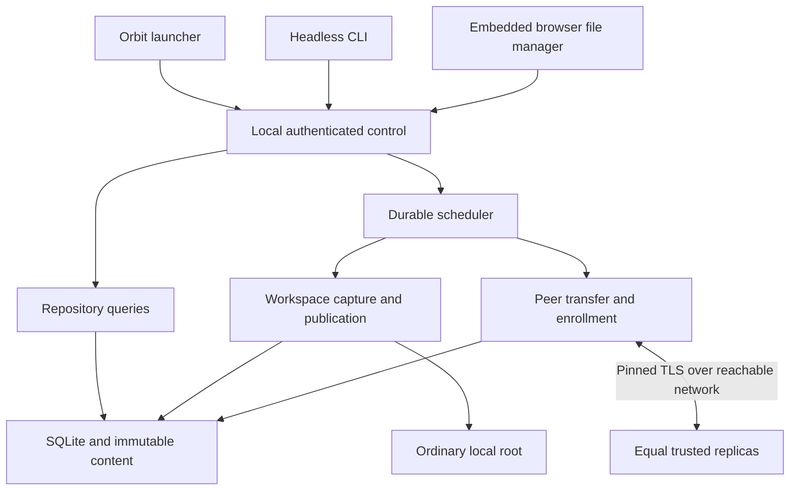

# Orbit revamp architecture

Status: proposed implementation baseline, 2026-10-01. Existing authoritative
contracts remain [protocol](protocol.md), [persistence](persistence.md),
[operations](operations.md) and [verification](verification.md).
The gates below must produce executable evidence and updates to those contracts.
The [product brief](orbit-product.md) describes the experience.

## Preserve the engine; deepen the control interface

One Go daemon per device continues owning its identity, SQLite, content store,
scanner, publication journals, replication and scheduler. React/TypeScript/Vite
assets remain embedded. CLI, launcher and browser invoke the same control
operations. Runtime requires no Node service or hosted account backend.

Browser code never authors versions, chooses conflict winners, composes
membership revisions or performs filesystem IO itself. HTTP handlers validate
and dispatch; owning modules enforce authorization, generation checks,
idempotency, resource admission and durable recovery.

## Module ownership

| Existing module | Orbit work behind its interface |
| --- | --- |
| `internal/history` | Preserve immutable path/version/causal rules; consume new tests, avoid UI dependencies |
| `internal/repository` | Product labels/settings, directory/search queries, invitation/membership state, operation journals/pins and safe bounded record retention |
| `internal/workspace` | Root previews, import/publication, mkdir/move/delete planning and recoverable execution |
| `internal/replication` | Invitation-gated enrollment, key possession, approved membership transport, endpoint checks and existing data transfer |
| `internal/scheduler` | Durable/coalesced setup, propagation and file-operation work; cancellation/progress |
| `internal/control` | Deep operations for setup, enrollment, browse/read, file actions and maintenance |
| `internal/config` / `internal/state` | Typed configuration, safe identity transition, compatibility and exclusive process ownership |
| `cmd/filesync` and packaging scripts | Orbit entry/launcher compatibility, service/desktop integration and CLI adapters |
| `web/src` | Presentation, accessible interaction, control clients and operation-state rendering |

Prefer extending these modules over creating a parallel engine or wrapper
layers with equivalent complexity. Introduce internal seams for clock/randomness,
filesystem faults and browser launch only where production and a meaningful
test adapter differ.

## Persistent identity and presentation

Device IDs, key pins and workspace IDs remain cryptographic identities. A device
label is a mutable display preference and cannot authorize access. Workspace
display name and default selection likewise do not replace folder identity.
Colliding labels are valid and disambiguated in details.

Store device/workspace preferences in versioned repository records or a
separate typed product-settings format; adding fields to today's strict
`config.json` without a deliberate format migration is invalid. Labels received
from a peer are untrusted display data. Freeze whether they are owner-local
aliases or transmitted hints before O02; baseline is owner-local aliases with
the joining device name offered during approval.

Preserve existing state locations, `.filesync-internal`, wire domain separators
and version identities for the first Orbit release. Package an `orbit` launcher/
entry alias while retaining the existing `filesync` command. Existing configured
services/state are adopted explicitly; avoid starting two processes or choosing
between two possible states silently. A product rename is not a data migration.

## Control operations and results

Names below express interface responsibilities; O02 freezes exact schemas.

| Operation family | Inputs / essential result |
| --- | --- |
| Setup | Inspect/resume setup, preview/create workspace, root, limits, device label, stable operation ID |
| Enrollment | Create/revoke invitation, request join, approve exact key/request, track per-device rollout |
| Devices | Labels, endpoints, last contact, membership revision, direct observed copy states, retire preview/execute |
| Browse | Workspace, validated relative directory, filter/sort, bounded page cursor and observed view generation |
| Content | Exact version/read target, verified availability, bounded preview or pinned authenticated byte stream |
| File actions | Plan/import/mkdir/move/delete; exact reviewed targets/destinations, generation and idempotency key |
| History / attention | Reviewed heads, working basis, content readiness, stale reports and safe actions |
| Settings / recovery | Preview settings, operation progress, integrity, explicit cleanup, stopped-state recovery |

Every mutation has a durable operation identity and request fingerprint.
Multi-step operations expose phases, progress, retryability and partial results.
An expired replay cannot silently execute again. A read-only inspection never
performs cleanup or changes membership.

Preserve existing API routes until clients migrate; use additive versioned
operations and fixtures. Encode large counters/sizes using existing canonical
decimal strings. New errors must have a code, retryability and safe next action;
the frontend never parses human error text.

## Local launch and authentication

The desktop launcher locates the selected state, validates it, detects an
existing daemon and opens the local app through the authenticated bootstrap
interface. It reuses the exclusive-state rule instead of spawning duplicates.
Starting a temporary daemon and claiming an enabled user service are different.

Root selection uses a local-owner-authenticated daemon directory picker or
validated path entry. A browser upload directory input cannot be assumed to
provide the registered Linux path. Limit picker queries/pages, explain denied
directories, and keep this setup-only capability away from peer endpoints.
Open local folder dispatches a bounded local desktop-helper operation for a
verified registered directory, with direct arguments rather than a shell;
headless/missing desktop support returns an actionable unavailable result.

Choose a one-use browser handoff in gate G01. It must preserve loopback binding,
strict Host/Origin checks, HttpOnly/SameSite sessions and CSRF protection.
Bootstrap and invitation secrets cannot persist in browser storage, ordinary
URLs/history, command arguments, logs or support exports. If a transient URL
fragment is chosen, strip it immediately and consume it once; test the whole
handoff and leakage paths rather than assuming fragment placement is sufficient.

A headless administrator uses SSH and local CLI/control or an SSH tunnel.
Remote browser exposure is outside this baseline. The peer listener remains
separate from local control. Closing a browser or logging out of its session
does not stop an enrolled daemon or rotate its identity.

## Enrollment and membership rollout

An owner-authenticated operation issues a high-entropy invitation scoped to
one workspace, the inviting identity and a bounded lifetime. Invitation storage
uses a secret verifier/digest rather than a loggable plaintext token.
Invitation/attempt records have bounded count, body sizes, retries and retention.

The joining device generates its own persistent identity and proves possession
through established TLS/crypto libraries. Its client verifies the inviting key
bound to the invitation. A capability-gated request can disclose only bounded
enrollment metadata; it cannot reach ordinary inventory, chunks or control.
The owner approves the exact request transcript/key and selected workspace.
Disclosure of the invitation can create a request, never silently grant access.

G02 freezes the invitation transport, issuer/revocation policy, exact ownership
of approval and membership artifacts. An additive enrollment handler may use
the existing TLS listener only if ordinary data handlers retain their complete
key-pin/folder/membership checks. Unknown client certificates are not membership.
Alternatively isolate the enrollment listener; record the operational cost.

Membership remains a linear revision chain. Approval is bound to the expected
prior digest, joining key and workspace. Persist approval/rollout before
claiming enrollment complete. Devices still require exact accepted revision
agreement for content exchange. A distinct narrowly authorized control exchange
may carry owner-approved next revisions to an older active peer.

That control exchange must authenticate existing key possession, validate the
revision chain and enforce retirement. Mismatch never opens a chunk route.
Transport reachability, TLS identity, workspace authorization and revision
agreement remain separately checked.

Automatic propagation represents the recorded owner decision; it must not turn
any arbitrary network membership message into implicit local consent. G02 must
choose and model how approval authority is verifiable on receivers and persist
that policy, including its introduction into legacy states. Do not invent
unsigned transitive trust, a universal shared device key or a central file winner.

Concurrent approvals from different devices cannot silently fork configuration.
Use expected-revision checks and explicit fork detection/maintenance. Test
offline concurrent administration and a recoverable convergence procedure.
Retirement keeps its existing stronger survivor/known-history requirements.
An offline peer is never automatically retired to make a join look successful.

Endpoint configuration becomes validated durable control state with a safe
refresh mechanism; avoid rewriting configuration that still requires a manual
restart while the UI reports immediate success. Preserve legacy `peers.json`
import/configuration support deliberately. Each required pull direction must
be configured and tested, including forwarding through a hub.

## Browsing and content

Browse locally known workspace state from repository queries, including
pending content and conflicts. The current projection-only flat query is
insufficient. Return immediate children and navigable ancestor rows without
authoring synthetic directory history. Unknown remote changes remain unknown.

Freeze stable sorting/cursor invalidation and supported search semantics.
Baseline: filename/path search within the selected workspace, no full-text
index. Enforce page/body limits and index query paths. A view carries freshness/
generation; pagination cannot falsely represent a stable snapshot after edits.

Content reads bind an exact version, verify authorized availability and hold
GC pins/leases for their duration. Use bounded buffers and reservations; no
whole-file in-memory Blob path for large downloads. Verify corrupt/missing
chunks and abort incomplete reads visibly. Never substitute another version
when a requested version is unavailable. Cancellation/disconnect/restart release
leases safely. Preview budgets and safe MIME behavior are part of the contract.

O07 uses an authenticated native attachment response addressed by workspace
and exact version identity. The URL contains no secret or filesystem path;
existing session/bearer authentication remains mandatory on each request.
This avoids an additional prepared-handle capability lifecycle while retaining
version binding, range resume and scoped authorization. Stream pins last until
the response ends rather than expiring underneath a slow read. See the
[read policy](operations.md#o07-workspace-reads-and-preview-policy) and
[repository lifecycle](persistence.md#o07-browse-generations-and-active-reads).

Queries must distinguish the current working copy from captured heads. A
browser preview of a captured version identifies its version; it does not
quietly imply that unsaved local working bytes were captured.

## File mutation and recovery

G03 closes the file-action design before implementation. Import streams into
budgeted staging/managed content, commits a durable captured version, then uses
the existing publication machinery. A failed import preserves the prior path.
Destination overwrite requires an explicit reviewed plan. File actions use
root descriptors and existing path validation, never HTTP-handler `os.RemoveAll`
or string-concatenated filesystem paths.

Move/rename remains create destination plus delete source. Capture/protect
the source, journal the operation, install verified destination versions, then
revalidate the source before authoring/applying its deletion. Keep both safe
copies if recovery is ambiguous. Directory moves are resumable enumerated
batches; new children invalidate the reviewed subtree. Cross-workspace moves
are deferred. History stays path-based; optional activity provenance does not
rewrite causal ancestry.

Delete previews actual targets and generations, preserves captured bytes under
existing retention, authors explicit tombstones and uses safe publication.
All existing root-unavailable and mass-deletion safeguards apply. Unregistering
a root is not replicated deletion; canceling work is not undoing committed paths.
Deleted files queries metadata without pinning every payload indefinitely.

Recovery of identity/configuration/metadata is a stopped, exclusive, durable
transition. Freeze a recovery journal/procedure in G04. It changes the device ID
and TLS key, updates database author state with checked results, fences old
membership/endpoints and keeps roots/history. Restart may not author rolled-back
counters under an old key. Metadata backup is not an immutable-content backup.

## Design gates

| Gate | Decision and required experiment | Owning contracts |
| --- | --- | --- |
| G01 Local launch | Bootstrap exchange, first uninitialized daemon, singleton/service behavior, restart and secret-leakage tests | Operations |
| G02 Enrollment | Invitation proof/consent, opt-in listener, verifiable authority, sequential rollout, offline peer and competing approvals model | Protocol / operations |
| G03 File actions | Journaling, capture/publication ordering, preview tokens, source/destination races, directory partial recovery and read leases | Persistence / protocol |
| G04 Identity recovery | Fresh key/author fencing, config/DB consistency, interrupted transition, metadata restore plus missing payloads | Persistence / operations |
| G05 Compatibility | Product settings/schema, capability negotiation, mixed versions, legacy state/service adoption and rollback limits | Operations / protocol |

Each gate ends with a written outcome, executable reproducer/model, explicit
limitations, and matching owning-spec updates. A proposal or passing compilation
is not closure. Builders may select mechanisms within scope; they must ask the
owner only if evidence requires changing an approved product guarantee.
