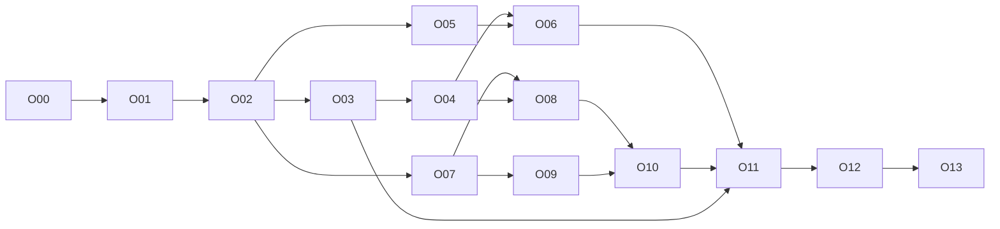

# Orbit implementation plan

Current work: the owner selected the terminal redesign on 2026-10-03. Start
with the [terminal plan](orbit-terminal-implementation-plan.md) and
[terminal tracker](implementation/terminal-status.md), initially T00. This
document retains the earlier browser-era plan and O14 relocation scope/evidence;
its browser milestones and O00 kickoff are historical for the current task.

Created 2026-10-01 for the owner's requested usability/UI/UX/function revamp.
This handoff defines work for the 6.1 Sol medium and 3.8 Flash development team.
It is a planning artifact; production behavior is unchanged and implementation
checks have not been run by this planning session.

## Start here

1. Read `AGENTS.md`, [scope](portfolio-scope.md#orbit-product-direction--2026-10-01)
   and [glossary](../CONTEXT.md).
2. Read [product vision/journeys](orbit-product.md) and
   [architecture/design gates](orbit-architecture.md).
3. Read [Orbit status](implementation/orbit-status.md); select the first eligible
   packet and its prerequisites. O00 is first.
4. Read that packet and its owning protocol/persistence/operations/verification
   contracts before changing behavior.
5. Implement through existing modules, run meaningful checks, update evidence
   and status, then continue to the next eligible packet.

No per-packet approval ritual is needed. The owner approved the direction and
requested this concrete handoff. Preserve core guarantees and record design
outcomes; seek input for an actual change to approved scope/guarantees.

## Outcome

Orbit is a personal drive across trusted Linux devices with ordinary fully
replicated local folders. Users create/join a workspace through a local browser
file manager opened by a desktop launcher. An optional owner-operated always-on
replica retains/forwards files. Explicit approved pairing replaces certificate/
membership-file juggling in the normal workflow. Background capture/sync
continues when the browser closes.

The revamp improves the product interface around the existing engine. It keeps
causal history, explicit conflicts, durable verified content, conservative
membership and root/retention safeguards. It adds no Google account service,
remote public file website, placeholders, multi-user sharing or new platforms.

## Current implementation and implications

| Existing reality | Required change |
| --- | --- |
| Local token-bootstrap operator console; IDs and flat paths dominate UI | Launcher, guided setup, labels, file hierarchy and contextual details |
| Per-folder manually approved membership; exact revision agreement | Invitation/consent workflow and narrowly authorized durable rollout |
| Explicit startup-loaded peer endpoints | Validated control operations, useful reachability tests and actual runtime adoption |
| Projection-only file list; limited browser file actions | Repository browse/search/content reads and shared recoverable mutation operations |
| Complete local folders plus immutable content/history | Accurate storage preview/accounting; keep mirror behavior |
| Historical restore under acquisition-age/version-count retention | Honest Deleted files/history, with no fixed deletion-time trash promise |
| Linux user service and packaged binaries | Orbit desktop entry, real startup status and legacy adoption |
| Source-inspected recovery/schema/key/query issues | O00 reproduction/repair before depending on recovery claims |
| P00–P16 scoped evidence; P17 actual owner use/explanation outstanding | Preserve evidence/history; validate final Orbit packages and actual owner use |

O00 candidates are source findings, not executed reproductions. The earlier
release evidence is not proof of the new workflows.

## Packet sequence

| Packet | Deliverable | Dependencies | Main lane |
| --- | --- | --- | --- |
| O00 | Recovery regression reproduction/repair and honest baseline | Existing engine | Sol lead |
| O01 | G01–G05 experiments, decisions, owning-spec updates | O00 | Sol lead |
| O02 | Product records, migration and shared control contracts | O01 | Sol lead |
| O03 | Launcher, service and restartable setup operations | O02 | Sol lead |
| O04 | Orbit shell and real first-device UI | O02, O03 | Flash + lead review |
| O05 | Invitation enrollment, endpoints, durable membership rollout | O01, O02 | Sol lead |
| O06 | Pairing/device UI and equivalent headless workflow | O04, O05 | Flash + lead review |
| O07 | Hierarchical browse/search, exact content and read leases | O02, G03 | Sol lead |
| O08 | File browser/previews/details UI | O04, O07 | Flash + lead review |
| O09 | Journaled import/mkdir/within-workspace move/delete | O01, O02, O07 | Sol lead |
| O10 | File actions, history/Deleted files, Needs attention | O08, O09 | Flash + lead review |
| O11 | Settings/storage/recovery, safe bounded record maintenance | O02, O03, O06, O09, O10 | Shared |
| O12 | Orbit packaging, migration/legacy adoption and runbooks | O04, O06, O08, O10, O11 | Sol integrates |
| O13 | Final failure campaign, actual usability/pilot and handoff | O00–O12 | Sol integrates + owner |

Packet details: [O00–O04](implementation/orbit-foundations.md),
[O05–O10](implementation/orbit-devices-files.md),
[O11–O13](implementation/orbit-release.md).



G03 closes inside O01. All graph nodes inherit gate/contract requirements;
the table lists complete dependencies. Mock layout may begin after O02, but
completion requires the real prerequisite operation.

## Usable milestones

| Milestone | Completion bar |
| --- | --- |
| M1: local Orbit | O00–O04: install/launch/create and capture ordinary files through UI |
| M2: personal sync | O05–O06: second device approved/pinned and real copies synchronized; offline rollout state visible |
| M3: browse your files | O07–O08: nested/searchable browser, exact preview/download, contextual status |
| M4: everyday management | O09–O10: recoverable file actions, reviewed conflicts and conditional restore |
| M5: dependable release | O11–O13: sustained limits, recovery, compatibility, native packaging and actual owner pilot |

Finish each vertical slice before claiming the next milestone. A screenshot
does not demonstrate pairing; a returned ID does not demonstrate safe recovery.

## Development team and task boundaries

| Role | Responsibility |
| --- | --- |
| Architect/plan owner | Set scope and interfaces; reconcile design evidence and dependencies; revise owning specifications when needed |
| 6.1 Sol medium lead | Recovery/identity, authorization, membership, persistence, file IO, migrations, resource admission, meaningful tests, integration and release |
| 3.8 Flash implementation lane | Bounded React/CSS/icon/copy work over frozen contracts; accessible dialogs/rows; specified browser scenarios; reviewed documentation/assets |

The role split controls interfaces and review ownership; every lane has the
same acceptance bar. Flash tasks must specify exact files, contracts, error/
pending/stale states and observable completion. Changes to authentication,
causality, SQL journals or filesystem safety belong in a lead-owned packet.
The lead reviews merged presentation against real engine behavior.

Parallel work is allowed only on independent ready packets or nonoverlapping
contract-bound slices. O03, O05 and O07 can proceed after O02; frontend layout
can proceed against frozen fixtures while its real integration dependency is
being implemented. Separate source ownership/worktrees prevent shared-file
collisions. A lead owns shared control types, migrations and integration.
Preserve unrelated changes, including the existing untracked `TODO.md`.

### Lead developer prompt

> Read AGENTS.md and docs/orbit-implementation-plan.md, then scope, glossary,
> product, architecture and Orbit status. Start with the first eligible packet
> (initially O00). Read its prerequisites/owning contracts. Implement the packet
> and its meaningful validation through existing modules. Close applicable
> gates with evidence; preserve core guarantees and unrelated changes. Use
> marked disposable roots for all fault/destructive harness actions. Record
> actual commands, results, limits and next eligible work in Orbit status.
> Continue eligible work; do not mark a packet complete from compilation,
> mocks or unexecuted checks.

### Bounded frontend task template

> Implement [specific O04/O06/O08/O10/O11 slice] in [owned files]. Read the
> product brief, selected packet and frozen [control fixtures/types]. Use those
> operations and semantic tokens. Cover [loading/empty/error/stale/pending/
> partial states] and [keyboard/focus/narrow-window scenario]. Do not invent
> engine behavior in React. Verify using [real browser scenario/build]. Return
> changed files, actual results, limitations and integration dependencies to
> the lead. Only the integrated real workflow can complete the packet.

## Verification and evidence

I01–I20 remain authoritative. [Verification](verification.md#orbit-revamp-verification-planned)
adds planned I21–I28 for launch, setup, enrollment, rollout, browse/content,
file operations, usability and bounded lifecycle records.

Run packet-targeted tests first, then broaden for changed semantics. New
recovery/enrollment/mutation tests must cross the production interface and
catch realistic failures, not mirror implementation branches. Browser tests
assert actual files/versions/device authorization as well as rendered states.
Use the existing puppeteer-core installation; add the browser runner in O04.
Do not report a missing browser, absent test match or mock run as a pass.

Each completed packet creates evidence as it runs:

```text
docs/evidence/orbit-OXX-<run-id>/
  manifest.json   revision, packages, schema/protocol, hosts, fixture and seed
  commands.md     actual setup/run/cleanup and fault schedules
  results.json    assertion outcomes, measurements and skipped checks
  summary.md     conclusion, limitations and next work
  screenshots/   relevant browser states, when applicable
```

Existing Go/model/process/harness targets come from the Makefile; frontend
build currently uses `npm ci` and `npm run build` in `web`. Packets identify
new test groups/runner commands as deliverables. Full suite/build/package/demo
checks, native hosts and explicit VM experiments are required for the final
affected guarantees, not for documentation-only planning.

The destructive-harness marker is `.orbit-disposable`; preserve canonical
path/process validation in existing testkit/validation workers. Personal pilot
markers do not authorize fault injection. Native checks create new private
roots/ports/processes and never stop an existing service or modify the owner's
firewall/VPN. Long-running checks remain observable and cancellable.

## Risks and design work

| Risk | Resolution / release gate |
| --- | --- |
| Pairing endpoint accidentally weakens data authentication | G02 model and negative endpoint tests; isolated capability scope; O05 |
| Owner approval becomes unverifiable automatic membership | Explicit artifact/authority policy, predecessor validation, retirement/fork cases; G02 |
| File-manager actions bypass captured-version protection | Existing module interfaces, journals, stale tokens and injected process/IO faults; G03/O09 |
| Identity transition leaves key/config/database inconsistent | Stopped exclusive journal/fencing, restart/key/author assertions; O00/G04/O02 |
| Rename implies atomic directory/history semantics | Preserve delete/create, path history and visible partial progress; O09/O10 |
| Browser calls a stored/offline copy globally synchronized | Independent content/receipt/applied/contact fields; O06/O08/O10 |
| Retention looks like guaranteed trash/backup | Conditional restore and accurate metadata/payload distinction; O10/O11 |
| Daily daemon eventually fills metadata with finished work | Safe record pruning and explicit replay expiry; O11 |
| Branding/migration strands old users or starts two daemons | Stable identities/paths, explicit service adoption, capability checks; G05/O12 |
| Attractive screenshots obscure missing functionality | Real-operation browser assertions, packaged-native checks and owner pilot; O13 |

## Requirement coverage

| Requirements | Primary packets |
| --- | --- |
| U01 Orbit name/compatibility | O02, O04, O12 |
| U02 single-owner self-hosted Linux/full copies | O01, O03, O05, O12, O13 |
| U03 optional equal always-on replica | O05, O06, O13 |
| U04 default/changeable/advanced roots | O03, O04, O06, O11 |
| U05 invitation/authentication | O01, O05, O06 |
| U06 existing reachable network | O03, O05, O06, O12 |
| U07 file-manager UX | O04, O07, O08, O10 |
| U08 local launch/headless control | O01, O03, O04, O06, O12 |
| U09 names/settings/status | O02, O06, O08, O11 |
| U10 previews and basic file actions | O01, O07–O10 |
| U11 attention/history/deleted files | O07, O08, O10, O11 |
| U12 startup | O03, O11, O12 |
| U13 migration/legacy preservation | O00–O02, O12 |
| U14 replacement recovery | O00–O02, O06, O11–O13 |
| U15 visual/accessibility | O04, O06, O08, O10, O13 |
| U16 simple onboarding/headless parity | O03–O06, O11–O13 |

All S01–S22 retain their original coverage and require regression evidence when
affected. O13 reconciles both requirement sets against final packages.

## Handoff and completion

Keep [Orbit status](implementation/orbit-status.md) resumable: packet state,
checked prerequisites, files/contracts, actual commands/results, evidence,
remaining limitations and next eligible work. Gate findings change the owning
specification before dependent implementation; packets never silently override it.

Orbit release is complete when every acceptance criterion has actual evidence,
legacy guarantees are preserved, the owner can perform normal desktop workflows
without terminal steps, and the actual pilot/explanation requirements are met.
Current planning is complete; implementation starts at O00. Existing P17
owner-use/explanation evidence remains outstanding until actually fulfilled.


## Owner-selected follow-up: O14 local location changes

Selected 2026-10-03; prerequisites O03, O09, O11, O12. Implements the owner's
request to relocate an existing workspace locally, extending U04 beyond setup.
Owning contracts: persistence's Local root relocation section and operations'
Change local folder location section. No peer protocol or membership change.

Acceptance criteria:

- Settings and stopped/live CLI use the same authenticated relocation control.
- Same-filesystem moves preserve files, scratch, history, working basis,
  workspace identity and prior pause state; new-location scans fabricate no edits.
- Cross-filesystem copies verify contents and retain/report the original safety
  copy; unsupported objects or detected editor changes refuse the switch.
- Occupied, overlapping, stale and symlink-parent destinations are refused.
- Durable intent recovers interruptions before rename, after rename and after
  registration commit; local scanning/publication/mutations wait during relocation.
- New-root notifications capture subsequent edits; UI retains errors/inputs,
  provides keyboard focus and reports actual completion.
- Record executed validation and unexecuted failure models in the tracker;
  retain outstanding P17 owner evidence.
