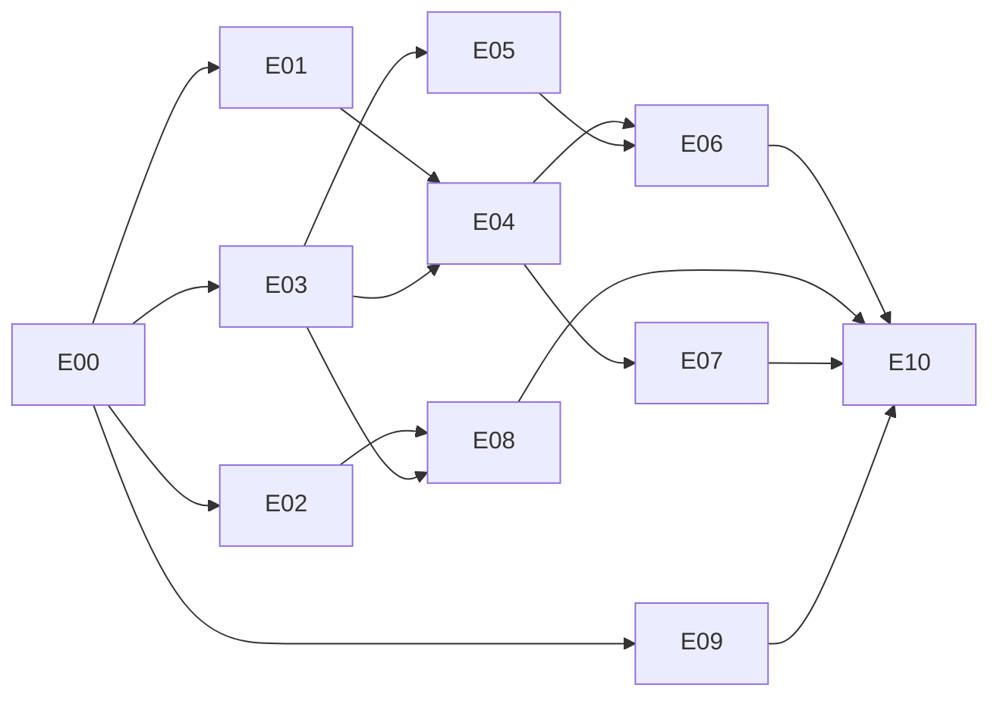

# Orbit onboarding and everyday-use implementation plan

Date: 2026-10-08. During the first Orbit 2.0.0 owner trial (PC creates, laptop
joins over Automatic mode) the owner hit repeated onboarding friction and approved
the changes below. This plan records the original implementation handoff. E00–E10 are now complete;
the 2026-10-09 extension E11–E13 adds onboarding polish and participation controls.
The tracker records current evidence and trial installations.

Approved by the owner on 2026-10-08:

1. **Working defaults.** A fresh device works without choosing ports, connection
   modes or startup words: Automatic connection for create *and* join, login
   startup on desktops/laptops, unattended startup on headless hosts with the
   lingering step explained, and an ephemeral control port.
2. **Standard keyboard behavior.** Arrow keys as well as Tab move between rows and
   form fields; fixed choices are selectors, not typed words; Enter advances;
   Esc goes back.
3. **A read-only Files view**, which is the default screen when the device is set
   up and nothing needs attention. This reverses the 2026-10-03 decision that the
   terminal offers no file browsing ([UX amendment](orbit-terminal-ux.md#owner-amendment-2026-10-08)).
4. **A short pairing code** (`XXXX-XXXX`) through the Orbit service, replacing
   the ~1.7 KB pasted invitation for Automatic and self-hosted modes
   ([WAN UX amendment](orbit-wan-ux.md#short-pairing-code-amendment-2026-10-08)).
5. **Fixes for every trial finding** F01–F16 in the [tracker](implementation/onboarding-status.md#trial-findings).
6. **Relay egress protection** with a monthly byte budget on the hosted service.
   Public relay pools are not an alternative (see [scope boundaries](#scope-boundaries)).

## Start here

1. Inspect the working tree and the [onboarding tracker](implementation/onboarding-status.md).
2. Read [scope](portfolio-scope.md), [glossary](../CONTEXT.md),
   [terminal UX](orbit-terminal-ux.md) (including its 2026-10-08 amendment),
   [terminal architecture](orbit-terminal-architecture.md),
   [WAN UX](orbit-wan-ux.md), [WAN architecture](orbit-wan-architecture.md),
   [network protocol](orbit-wan-protocol.md) and the [operator guide](orbit-net-operator.md).
3. Read the first eligible packet in [the packet details](implementation/onboarding-packets.md)
   and its prerequisite evidence. Consult [protocol](protocol.md),
   [persistence](persistence.md), [operations](operations.md) and
   [verification](verification.md) for the behavior being changed.
4. Implement through the owning modules, run the packet's checks and record actual
   results in the tracker. Continue eligible work without a per-packet approval ritual.

T, W, P and O plans remain historical baselines; their evidence is preserved and
not re-opened by this plan. Engine guarantees (causal history, capture before
replacement, reviewed mutations, pinned identities, end-to-end encryption) are
unchanged. A packet that would weaken one needs an owner decision first.

## Result

On the next trial the owner installs the new build on each machine and:

1. runs `orbit` on the PC, accepts the prefilled defaults and presses Enter through
   one review screen;
2. presses `a` (Add device) and reads an eight-character code such as `K7Q4-M9XD`;
3. on the laptop and the Pi, runs `orbit`, chooses **Join**, types the code and
   accepts the defaults (the Pi is offered unattended startup with the one
   `sudo loginctl enable-linger` command shown);
4. on the PC, presses Enter on the approval item, compares the verification code
   and presses `a`;
5. lands on the Files view on every device, seeing the same files with their sync state.

No port conflict, manual network mode, truncated code, hidden-field paste,
broken Enter key, stale warning or unrunnable advice appears on that path.
Local-only mode keeps the long invitation and file transfer, now shown and
copied correctly.

## Blocks and packets

| Block | Packets | Reviewable result |
| --- | --- | --- |
| A Baseline | E00 | Every finding reproduced on disposable state; gates scoped |
| B Reliable foundations | E01–E02 | One daemon owner with working service defaults; attention that heals and offers runnable actions |
| C Familiar onboarding | E03–E05 | Standard keys; join with Automatic defaults; long invitation shown/copied whole |
| D New capability | E06–E08 | Short pairing code; approval wait within service limits; Files view |
| E Service and release | E09–E10 | Monthly relay budget; packaged trial build installed and rehearsed |
| F Polish and participation | E11–E13 | Short review cards, clear approval/success flow, real Leave and reviewed removal |

| Packet | Deliverable | Dependencies |
| --- | --- | --- |
| E00 | Baseline, reproductions of F01–F16, gate scoping | Existing repository at `58af25e` or later |
| E01 | Daemon lifecycle and service defaults (F01, F04, F12 startup, F14) | E00 |
| E02 | Self-healing attention and runnable actions (F02, F03, F09, F13) | E00 |
| E03 | Keyboard, form and paste conventions (F06, F15) | E00 |
| E04 | Join and setup defaults; actionable onboarding errors (F07, F08, F11, F16) | E01, E03 |
| E05 | Long invitation display, copy and file transfer (F05) | E03 |
| E06 | Short pairing code through the Orbit service; EG1 | E04, E05 |
| E07 | Approval waiting within service limits (F10) | E00 (diagnosis), E04 |
| E08 | Read-only Files view and default landing; EG2 | E02, E03 |
| E09 | Monthly relay egress budget and busy-relay UX; EG4 | E00 |
| E10 | Integration, packaging, host migration and trial readiness | E00–E09 |
| E11 | Onboarding copy, colour and README mark | E10 |
| E12 | Post-confirm flow and approval polish | E11 |
| E13 | Real Leave, reviewed Remove Device and trial install | E12 |

The table is authoritative. Default execution is sequential in table order.
If parallel work is explicitly requested, E08 (terminal view files) and E09
(`cmd/orbit-net`, `internal/rendezvous`) touch separate modules; one worker
owns shared contract types, control wiring, schemas, packaging and final integration.

## Design gates

A gate closes when its record names the selected design, executable evidence,
the updated owning specification and remaining limitations. Dependent code is
not accepted before its gate closes.

| Gate | Question to close | Owning packet |
| --- | --- | --- |
| EG1 Short-code security | Code format and entropy, PAKE construction and Go implementation, mailbox semantics (single claim, one password attempt, expiry), squatting/DoS bounds, operator visibility and whether the profile privacy text must change | E06 |
| EG2 Files-view truthfulness | Which per-file states are derivable from existing repository and W12 observations without new guarantees; how "on other devices" is qualified (saved/stored/applied, freshness) | E08 |
| EG3 Host-class startup default | How Orbit decides desktop versus headless, how lingering is checked, and that no privileged command ever runs implicitly | E01 |
| EG4 Relay egress accounting | What `orbit_net_relay_bytes_total` counts (in, out or both), how a monthly budget persists across restarts, reset boundary, and device-visible behavior when it is spent | E09 |

## Milestones

| Milestone | Completion bar |
| --- | --- |
| M1 Nothing breaks on a busy host | E01–E02: service starts with another app on 8080; one daemon owner; attention clears itself and every suggested action runs |
| M2 Familiar first run | E03–E05: arrows/selectors/Enter work everywhere; join reaches approval with defaults; a long invitation can be copied whole |
| M3 Short code | E06–E07: two fresh disposable devices pair by typing an eight-character code over a local service fixture, without rate-limit errors while waiting |
| M4 Everyday view | E08: the default screen of a healthy device is the Files view with qualified sync states |
| M5 Trial ready | E09–E10: budget deployed after owner confirmation, new package installed on PC/laptop/Pi, workarounds removed, scripted rehearsal passes |

## Workers

The master architect owns product flow, interfaces and material design revisions.
**6.1 Sol Medium and 3.8 Flash High may each implement any eligible E packet**
under the same acceptance bar. Bring scope or guarantee changes to the owner with
a concrete proposed revision; routine reversible decisions are authorized.

### Worker kickoff

> Read AGENTS.md and docs/orbit-onboarding-implementation-plan.md, then
> docs/implementation/onboarding-status.md. Implement the first eligible E packet
> (initially E00) from docs/implementation/onboarding-packets.md, reading the
> referenced UX, architecture, protocol and operator specifications. Preserve
> existing evidence, device identities and causal histories. Use disposable marked
> state for every reproduction and fault; never run fault, flood or rate-limit
> tests against the deployed VPS or the owner's real Orbit folders. Record
> commands/results and limitations in the tracker, then continue with the next
> eligible packet and leave a resumable handoff.

## Validation and completion

I01–I28 and N01–N10 remain authoritative ([verification](verification.md)). E
packets add focused tests named `TestOnboardingEXX…`; discover them with
`go test -list '^TestOnboardingE' ./internal/... ./cmd/orbit/... ./tests/...`
before reporting, since zero matches is unexecuted coverage. TUI behavior needs
model tests **and** a real PTY check (the existing PTY harness) for key handling,
paste and resize. Run `make check` at each milestone and the full uncached race,
packaging and demo checks at E10.

Evidence lives in `docs/evidence/onboarding-eXX-<run-id>/` with `commands.md`,
`results.json` and `summary.md`, matching earlier plans. A packet is complete
only when every acceptance item has evidence; unexecuted checks stay labeled.

## Scope boundaries

- **Files view is read-only.** Rename, move, delete and editing happen in the
  owner's tools (opened from the view); Orbit gains no second mutation path for files.
- **No public relay pools.** Syncthing's relay pool is volunteer capacity for
  Syncthing clients using Syncthing's relay protocol, with no published permission
  for other software; n0's public iroh relays are rate-limited, development-only
  and Rust; Tailscale DERP serves Tailscale clients only. Orbit keeps its own
  operated service plus self-hosting, protects it with budgets (E09) and relies on
  direct routes (already observed: the 2026-10-08 PC↔laptop pair connected over
  direct QUIC).
- **Dedicated service VM** is an owner option, not planned work. E09 records the
  measured relay share so the owner can decide later whether `orbit-net` should
  leave the shared VPS.
- **No QR codes, phone clients, GUI file manager or clipboard daemons.** Clipboard
  copy uses the terminal's OSC 52 sequence where supported, with visible fallback.
- Short codes need the Orbit service; Local-only mode keeps long invitations and files.
