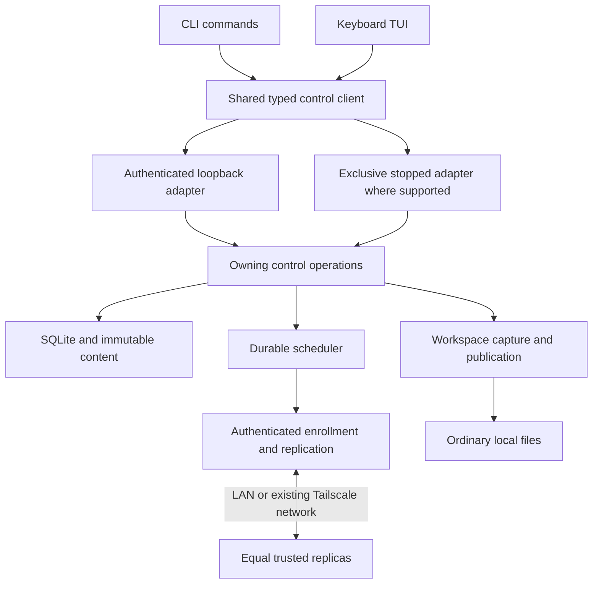

# Orbit terminal architecture

Status: T01 contract/design baseline frozen, 2026-10-03. T02–T05 now serve
scoped lifecycle/settings, authenticated enrollment, reviewed onboarding,
scoped sharing and sequential additive rollout.
Remaining operation families and production gates are tracked in T06–T12. [Terminal UX](orbit-terminal-ux.md) owns journeys;
[the packet plan](orbit-terminal-implementation-plan.md) sequences the work.
Engine contracts remain [protocol](protocol.md), [persistence](persistence.md),
[operations](operations.md), and [verification](verification.md).

## Deep controls and thin presentation

`internal/control` is the deep module: callers supply an intent or exact reviewed
plan and receive durable operation identity, phases, errors and observations.
It owns orchestration while history/repository/workspace/replication enforce their
existing invariants. CLI/TUI do not construct membership or causal parents.

Extract the reusable live/stopped selection, state discovery, authentication,
streaming and error translation from current command-local helpers. A shared
client module earns its interface because CLI and TUI need both production
adapters; it does not duplicate the control implementation. Freeze a small set
of typed operation families rather than a separate engine for each screen.

The live adapter reads owner-only local credentials and contacts only the
verified local control endpoint. It respects timeouts, cancellation, body bounds
and typed errors. A failed live request never silently retries through direct
database ownership. The stopped adapter first acquires the exclusive state lock;
operations requiring a running network daemon report that requirement or start
the selected daemon through the shared lifecycle operation.

## Module responsibilities

| Module | Responsibility |
| --- | --- |
| `internal/history` | Causal heads, reviewed parents and conflict invariants |
| `internal/repository` | Requests, setup/review records, labels, queries, read pins and generations |
| `internal/workspace` | Descriptor-rooted previews, adoption, capture, publication and relocation |
| `internal/replication` | Peer TLS, enrollment transport, endpoint use, verified transfer and rollout |
| `internal/scheduler` | Durable bounded jobs, per-folder progress, retry/cancel and recovery ordering |
| `internal/control` | Typed operation families and authoritative results/errors |
| proposed `internal/controlclient` | Shared live/stopped adapter and streamed content access |
| `internal/launcher`, config/state and service code | One daemon, finite initialization, network/startup configuration |
| `cmd/filesync` | Root dispatch, argument validation, compatibility and CLI adapter |
| proposed `internal/terminal` | TUI state/render/key handlers over injected typed client |
| scripts/packaging and terminal runbooks | Native packages, launch compatibility and reproducible checks |

These proposed packages are implementation defaults, not authorization to add
pass-through layers indefinitely. T01 may reuse existing packages if locality
and testability improve. Either implementation worker can work in any module
through its assigned packet. When parallel work is authorized, publish exact
task/file ownership and integration responsibility before starting it.
Screens can choose navigation and draft inputs; only the owning operation can
authorize a mutation, declare capture complete, or resolve a stale review.

## State, identity, transport and persistence

- Preserve device keys/IDs, shared-folder IDs, version envelopes, working basis,
  state paths and reserved scratch names. Use additive schemas with deliberate
  migrations; presentation names are separate from authorization.
- Keep network enrollment/replication separate from loopback owner control.
  An invitation binds an enrolled inviter, exact folder and expiring capability.
  TLS identity is verified before token disclosure. A pending requester has no
  data access. Existing members retain complete per-request folder authorization.
- Additional sharing reuses the persistent device key with a distinct scoped
  attempt identity. Preserve linear membership revisions, verified rollout,
  fork detection, conservative retirement and exact revision gates for data.
- Persist operation/root/request/endpoint/review state needed after process
  restart. A TUI screen is never the sole owner of pending work. Review of a
  changed root/head set is invalidated, not silently refreshed and executed.
- Store finite limits through one initializer. Report legacy missing-limit
  state honestly and require explicit migration/settings review. Expose enabled
  startup, running process, root/capture readiness and unattended capability
  separately. Closing a client does not stop the daemon.
- Exact-version export/editor/restore uses bounded streams and GC protection.
  Editor sessions retain reviewed heads and explicit result files. Crash cleanup
  releases safe temporary resources while preserving committed work and ambiguous
  recovery candidates under existing policies.

## Terminal behavior contract

The TUI is a Go terminal client with an event/render model and cancellable
background queries. The selected stack is **Bubble Tea v2**, **Bubbles v2** and
**Lip Gloss v2**. The T09 worker pins compatible stable releases after verifying
official APIs, amd64/arm64 builds, licensing and PTY behavior. Screen implementations
use the frozen library adapter and presentation fixtures, regardless of which
worker implements them.

### TUI stack decision — 2026-10-03

| Library | Responsibility | Module path |
| --- | --- | --- |
| [Bubble Tea](https://github.com/charmbracelet/bubbletea) | Event loop, keyboard/resize events, rendering and terminal ownership | `charm.land/bubbletea/v2` |
| [Bubbles](https://github.com/charmbracelet/bubbles) | Inputs, lists, viewports, progress and visible key help | `charm.land/bubbles/v2` |
| [Lip Gloss](https://github.com/charmbracelet/lipgloss) | Layout, spacing and semantic styles | `charm.land/lipgloss/v2` |

This is an Orbit-specific choice: keep the existing Go implementation and package
the terminal client with it. Bubble Tea's model/update/view design fits asynchronous
approval, capture and connection observations alongside resumable forms. Updates
can reject stale context/generation responses before changing the selected view.
Its [ExecProcess operation](https://pkg.go.dev/charm.land/bubbletea/v2#ExecProcess)
supports yielding to an interactive editor and resuming the program afterward.
T09 must still prove terminal restoration and daemon independence in a real PTY.

[tview](https://github.com/rivo/tview) is a credible Go alternative with ready-made
forms and grid widgets. We prefer Bubble Tea's explicit event/state model for the
approved journeys; the tradeoff is composing more of the screen layout and form
flow ourselves. Rust/Python/JavaScript alternatives would add another implementation
language or runtime to this Go application without an established product need.

Keep library types inside `internal/terminal`; the shared control client and
engine retain ordinary Go contracts. Perform control I/O in cancellable commands
and return typed completion messages to Update; background work must not mutate
view state directly. Persisted onboarding/operations remain controller-owned.
Use Bubbles for the initial forms; a separate wizard framework is unnecessary.
Focused inputs consume text before global navigation shortcuts, so typing `j`,
`k` or `q` never navigates or quits. Use direct editor argv through the tool
adapter and ExecProcess; exact-version/review/pin safety remains in T08's owner.

Exact dependency versions and the library/client/tool adapters are T09 deliverables.
Use one compatible v2 family and one terminal input/render owner. Record any
replacement justified by the build/PTY experiment here before dependent screens;
framework capabilities alone are not acceptance evidence.

Refresh preserves focus, selected item and entered values. A request completion
is matched to its operation/context before altering a screen; a late response
for a former folder cannot mutate the new selection. Use bounded pages and
polling/event queues rather than copying complete inventories into view state.
Render filenames as terminal-safe text; control characters never become escape
sequences. Use semantic focus/selection/status roles, terminal-default colors
with a colorless fallback, and visible action help. Test 80x24 and a narrower
window, long/wide names, pasted input, resize and external-editor return.

Bare `orbit` opens setup or overview in a TTY; non-TTY use returns concise
status. Human output and structured JSON are separate renderers of typed results.
Do not emit TUI escape sequences, progress or invitations into JSON/log streams.
Script mutations require explicit reviewed inputs rather than invisible prompts.
Explicit user requests can output an invitation for transfer; logs/support exports
retain redaction. User paths may appear in deliberate local output, with display
escaping. Cancellation of the interface and cancellation of committed work remain
different actions.

## Design gates

| Gate | Decision/proof required | Owning packet |
| --- | --- | --- |
| TG1 Enrollment transport | Inviter pin/certificate binding, replay-bound possession transcript, folder scope, unknown-client admission without opening data/control, approved artifact and endpoint exchange | T01 design; T03/T05 production proof |
| TG2 Durable onboarding | Root review generation, initialization ordering, resumable request/root/endpoint phases, bootstrap preservation and truthful readiness | T01 design; T04 proof |
| TG3 Shared adapters | Live/stopped ownership/authentication, finite initialization, daemon singleton, stream/error/cancel semantics | T01 design; T02/T06 proof |
| TG4 Reviewed content workflow | Exact-version/read pins, editor session lifetime, stale heads, streaming upload, restore/copy provenance and replay | T01 design; T08 proof |
| TG5 Terminal/legacy lifecycle | TTY detection, signal/resize/editor terminal restoration, service modes, entry aliases and compatible migration/rollback | T01 design; T09/T12 proof |

Each gate records a written design, an executable experiment/model, owning-spec
updates and production acceptance evidence. An earlier G01–G05 experiment does
not close the newly identified production integration gaps automatically. The
assigned worker executes experiments and repairs within approved scope; the
master architect/designer owns material architecture and UX revisions. Maintain
explicit open evidence until the relevant packet demonstrates it.

## T01 frozen boundary and gate outcomes

Use the [typed schema](../schemas/terminal-control-v1.md),
[gate decisions](terminal-design-gates.md) and
[exact source ownership](implementation/terminal-source-ownership.md). TG1–TG5
designs are resolved with bounded executable evidence; their production proof
remains open. The isolated enrollment listener preserves mandatory peer mTLS.
The executable serves the lifecycle/settings, enrollment and reviewed setup/join
subsets. Full operation-family parity and terminal entry remain later packets.

## T08 content implementation seam

`internal/control/terminal_content.go` owns typed content review and mutations;
`terminal_sessions.go` owns admission, private verified exports, staging and
recovery lifecycle. `internal/controlclient/content.go` implements authenticated
raw streams with live/stopped ownership; `tools.go` supplies direct argv and the
Linux result-size limiter. CLI adapters consume the same typed operations.
Repository resolution/copy transactions save replay effects with causal creation;
workspace review observes safe named bytes, while publication retains its owning
recovery protections. Content serialization is independent of status/service IO.

`reviewed_content_v1` advertises implemented families; the additive bounded
`conflicts` query and reviewed session `discard` are recorded in the owning
[terminal schema](../schemas/terminal-control-v1.md#t08-production-content-capability--2026-10-04).
Status cannot initiate cleanup. Source exports reopen sequentially to retain only
one exact-read chunk buffer; response pins outlive session expiry. The CLI/session
flow is documented in [the recovery runbook](runbooks/terminal-recovery.md).
T09 supplies the terminal/tool yielding adapter; T11 integrates it with these
reviewed content sessions and everyday screens.

## T09 frozen shell adapters — 2026-10-04

Pins: Bubble Tea `v2.0.10`, Bubbles `v2.2.1`, Lip Gloss `v2.0.6`, with one
resolved v2 dependency graph. Official release/API links and exact module license
texts are recorded in [dependencies](dependencies.md) and `NOTICE`.
`internal/terminal` alone owns Charm types and the input/render loop.

`terminal.Run(ctx, Queries, Options)` accepts the existing typed `Query` seam,
explicit input/output, colorless rendering and an optional owner tool. It does
not initialize, start or stop the daemon. `orbit tui` is the development entry;
non-TTY or `--json` goes to ordinary status. Bare entry remains T12.
Overview shows attention before registered folders; section/detail navigation
and command hints are shell behavior. T10/T11 own actual workflow screens.

One cancellable query lane serializes page/control work, with a five-second
deadline and a three-second refresh tick. Navigation increments a generation,
cancels the old command and coalesces to the latest context after it returns.
Request identity plus generation gate query replies. Tool replies also carry
generation. Background commands never update the model directly. Search is
page-local, retains at most 256 characters, and receives ordinary text/paste
before navigation shortcuts. A paste is reduced to 4096 bytes before conversion
and input admission; the terminal library decodes incoming events before this
application limit. Pages retain at most 20 items per collection.

Folder/device queries with an explicit limit now use repository SQL keyset
pages, with selector-bound cursors and live labels rather than review snapshots.
No-limit compatibility lists and aggregate status retain their existing semantics;
their cursors must not be confused with folder/device cursors. Attention retains
T07's bounded response and existing query computation. No query in this shell
scans files or authorizes a mutation.

`controlclient.LimitedToolCommand` is the shared direct argv/file-size adapter;
`terminal.Tool` supplies its command, admitted paths and limit to Bubble Tea
`ExecProcess`. T09's explicit development `--tool-file` uses scratch files in
PTY evidence. T11 must supply actual reviewed session paths/results from T08
and obtain a fresh review before committing. Tool return never commits a merge.
The CLI alone owns signals (the Bubble Tea signal handler is disabled); two
handlers raced its unbuffered quit send against context shutdown in the initial
repeated PTY run. SIGTERM cancels both the client context and its active tool; successful and
failed tool returns restore raw input. Quit/Ctrl-C only cancel client queries.
The PTY runner verifies exact terminal attributes and continued capture by the
same separately owned daemon. Native hosts and reviewed-editor journeys remain
T11–T13. See [shell runbook](runbooks/terminal-shell.md).

## T10 onboarding and management seam — 2026-10-04

`internal/terminal/{setup,join,approval,share,setup_render}.go` adds focused forms,
exact-request review and folder/device screens to the T09 event loop. The same
request/generation lane serializes bounded polls and explicit operations.
Commands capture immutable inputs and return results; only Update changes view
state. Esc can abandon a waiter; it cannot undo admitted daemon work. Retrying an
ambiguous submission retains its operation identity and reviewed intent.

`onboarding_management_v1` advertises bounded unfinished-setup discovery and
folder-management observations. Setup discovery includes blocked/partial jobs
and SQL keyset pages of operation IDs/phases/roots, without private intents or
capabilities. Folder-management detail retains protocol-bounded membership and
T07's qualified status; it performs no scan or cleanup. The join verification
code comes from the owning enrollment transcript/status and is persisted in the
existing Result requests vocabulary, never fabricated from a request ID.

`controlclient.Setup` is shared by CLI and TUI. Before submission it retains the
exact private reviewed request and whether listener changes need restart. That
restart requirement survives response loss even after desired settings are saved.
The entry adapter supplies the existing selected-daemon stop/EnsureDaemon callback;
no launcher/client dependency cycle or service-ownership bypass is introduced.
Completed progress polls refresh current readiness instead of asserting a stored
completion is current availability. Conservative unregister/retire previews keep
execution in existing procedures; a known fork cannot be resumed through the
ordinary folder shortcut. See [onboarding runbook](runbooks/terminal-onboarding.md).
