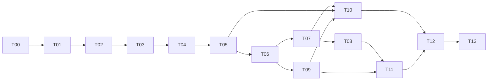

# Orbit terminal redesign implementation plan

Network/setup direction was amended on 2026-10-05 by the owner-selected
[native WAN plan](orbit-wan-implementation-plan.md). Use its W packets for automatic
connections and simpler onboarding. This T plan remains the implementation baseline
and retains its unfinished technical release checks and historical evidence.

## Owner-directed delivery amendment — 2026-10-04

The owner deferred personal-use observations and the unaided learning/explanation
review until after project delivery. They are follow-up activities, not engineering
completion gates. Finish automated validation, product polish, measured resource
behavior and evidence-backed portfolio artifacts now. Retain historical P17 pilot
records and data; do not claim automated campaigns establish personal adoption or
owner understanding. Required technical checks and declared engine guarantees
remain in force; report unavailable network/host conditions explicitly.


Planning baseline: 2026-10-03. The owner approved the terminal direction and
requested this implementation handoff for workers using either **6.1 Sol Medium**
or **3.8 Flash High**. Either worker can implement any eligible packet; model
choice does not assign architectural authority or restrict implementation scope.
Implementation begins at T00. All T packets are pending; this planning session
has executed no application, network, TUI, service, fault, or owner-pilot checks.

## Start here

1. Read `AGENTS.md`, [scope](portfolio-scope.md), and [glossary](../CONTEXT.md).
2. Read the agreed [terminal UX](orbit-terminal-ux.md) and
   [terminal architecture](orbit-terminal-architecture.md).
3. Read [terminal status](implementation/terminal-status.md). Select the first
   pending packet whose dependencies are complete, initially T00.
4. Read that packet, its prerequisites, and its owning engine contracts.
5. Complete its implementation and acceptance evidence, update status, and
   continue eligible work. Routine fixes, dependencies, and reversible design
   details need no new approval. Ask only for changes to approved scope or
   guarantees; technical design gates are engineering work.

Scope owns product requirements; terminal UX owns journeys and presentation.
Protocol, persistence, operations, and verification retain their respective
engine contracts. This plan sequences implementation. A packet cannot weaken
a guarantee to pass a check. Historical P/O results remain dated evidence;
current terminal acceptance requires current production-interface evidence.

## Outcome and six blocks

Orbit becomes a background Linux sync daemon with a small keyboard TUI and
independent CLI commands. Files remain ordinary local files edited with normal
applications. Create/join, folder sharing, qualified status, reviewed conflicts,
history/restore, storage, and recovery are understandable through names and paths.
LAN or an existing Tailscale network provides connectivity. A future GUI can
invoke the same controls. Preserve identity, ancestry, roots, recovery, and legacy
compatibility; retain outstanding P17 owner use and unaided explanation.

| Block | Packets | Deliverable |
| --- | --- | --- |
| A Contracts and baseline | T00–T01 | Reproductions, contract fixtures, design gates and source ownership |
| B Daemon and onboarding | T02–T05 | Real startup, secure reachable enrollment, reviewed setup, additional-folder sharing |
| C Everyday CLI | T06–T08 | Named commands/context, qualified status, attention, conflicts/history/restore |
| D Small TUI | T09–T11 | Keyboard shell, create/join forms, everyday management over working controls |
| E Delivery | T12 | Terminal entry, packages, legacy migration, completions and runbooks |
| F Release evidence | T13 | Fault/regression campaign, native hosts, owner use and resumable release handoff |

## Packet dependencies

| Packet | Deliverable | Dependencies | Owner | Detail |
| --- | --- | --- | --- | --- |
| T00 | Honest baseline and failing reproductions | none | Assigned worker | [foundations](implementation/terminal-foundations.md#t00--baseline-and-reproductions) |
| T01 | Typed contracts and terminal design gates | T00 | Assigned worker | [foundations](implementation/terminal-foundations.md#t01--contracts-and-design-gates) |
| T02 | Shared client, daemon lifecycle and finite initialization | T01 | Assigned worker | [foundations](implementation/terminal-foundations.md#t02--shared-client-and-daemon-lifecycle) |
| T03 | Authenticated network invitation and approval | T01, T02 | Assigned worker | [foundations](implementation/terminal-foundations.md#t03--authenticated-network-enrollment) |
| T04 | Root adoption, durable create/join and CLI onboarding | T02, T03 | Assigned worker | [foundations](implementation/terminal-foundations.md#t04--reviewed-setup-and-resumable-joining) |
| T05 | Reused device identity, endpoints and folder rollout | T03, T04 | Assigned worker | [foundations](implementation/terminal-foundations.md#t05--additional-folder-sharing-and-rollout) |
| T06 | Command vocabulary, name/path context and scripting | T02, T04, T05 | Assigned worker | [CLI/TUI](implementation/terminal-cli-tui.md#t06--commands-and-context) |
| T07 | Qualified status, persistent attention and diagnostics | T02, T06 | Assigned worker | [CLI/TUI](implementation/terminal-cli-tui.md#t07--status-attention-and-diagnostics) |
| T08 | Bounded conflict review, editor sessions and restore | T06, T07 | Assigned worker | [CLI/TUI](implementation/terminal-cli-tui.md#t08--conflicts-history-and-restore) |
| T09 | TUI shell, keyboard and terminal lifetime | T01, T02, T06 | Assigned worker | [CLI/TUI](implementation/terminal-cli-tui.md#t09--tui-shell-and-terminal-lifetime) |
| T10 | TUI create/join, device and folder setup | T04, T05, T07, T09 | Assigned worker | [CLI/TUI](implementation/terminal-cli-tui.md#t10--tui-onboarding-and-device-management) |
| T11 | TUI everyday status, attention, conflict and recovery | T07, T08, T09 | Assigned worker | [CLI/TUI](implementation/terminal-cli-tui.md#t11--tui-everyday-management) |
| T12 | Entry, packages, compatibility and operator docs | T10, T11 | Assigned worker | [release](implementation/terminal-release.md#t12--packaging-and-compatible-entry) |
| T13 | Integrated release campaign and owner evidence | T00, T01, T02, T03, T04, T05, T06, T07, T08, T09, T10, T11, T12 | Assigned worker + owner evidence | [release](implementation/terminal-release.md#t13--release-campaign-and-portfolio-delivery) |



The table is the full dependency contract; the diagram shows the main paths.
T09 may proceed alongside T07/T08 after T06. T10 and T11 can proceed together
after their prerequisites, with separate screen files. Fixture work can begin
earlier under a bounded task, but only real integrated controls complete a packet.

The [selected TUI stack](orbit-terminal-architecture.md#tui-stack-decision--2026-10-03)
is Bubble Tea v2 with Bubbles v2 and Lip Gloss v2. T09 owns compatible version
pins, library/tool integration and actual PTY evidence before T10/T11 screens.

## Usable milestones

| Milestone | Completion bar |
| --- | --- |
| M1 CLI personal sync | T02–T04: create and pair two ordinary installs, approve identity, capture and transfer verified files; resume an interrupted join |
| M2 Practical CLI | T05–T08: another folder shares to the same device; status/attention and reviewed conflict/restore work against a live daemon |
| M3 Terminal daily use | T09–T11: keyboard-only onboarding and management; interface exits without stopping sync |
| M4 Release | T12–T13: packaged native workflows, legacy adoption, failure evidence and portfolio delivery; owner review follows delivery |

M1 is tested before investing in full TUI screens. A returned request ID or
rendered success screen does not establish enrollment or data transfer.

## Architect and implementation workers

| Role | Responsibility |
| --- | --- |
| Master architect/designer (the planning agent) | Own the agreed UX, architecture, packet ordering and review standards; assess specification contradictions and material design revisions |
| Assigned implementation worker (6.1 Sol Medium or 3.8 Flash High) | Implement any assigned eligible packet, including engine, security, persistence, CLI/TUI, integration, tests and documentation; record evidence and a resumable handoff |
| Product owner | Decide changes to approved product scope/guarantees and supply actual personal-use/unaided-explanation evidence |

Both worker models follow the same plan and acceptance bar. Each assigned worker
owns its packet's implementation and integration; shared types, engine code and
presentation are assigned by task, not model. Workers resolve routine engineering
choices and design experiments within the documented architecture. Surface
material architecture/UX contradictions to the architect with evidence and a
concrete proposed correction, while continuing independent authorized work.

Choose either worker for the next eligible packet. The default is sequential
execution, with the worker continuing eligible work and leaving a handoff at a
model/session switch. If parallel worker execution is explicitly authorized,
assign nonoverlapping files or worktrees and identify the integration task owner.
This plan does not require one worker to supervise or spawn the other.

Architect review assesses architecture and UX where review is requested or a
material revision needs resolution. Packet completion depends on its acceptance
evidence; it does not require a new per-packet approval ritual.

### Worker kickoff prompt

> Read AGENTS.md, docs/orbit-terminal-implementation-plan.md, terminal UX and
> architecture, scope/glossary, and terminal status. Begin with the first eligible
> T packet, initially T00. Preserve the existing uncommitted relocation work.
> Read the packet and owning contracts, reproduce relevant gaps, implement through
> the owning modules, and run production-interface acceptance checks. Update
> actual evidence/status; continue eligible packets without per-packet permission.
> You are an implementation worker; either 6.1 Sol Medium or 3.8 Flash High can
> perform this task. Implement and integrate the packet under the documented
> architecture. Report material design contradictions with evidence and a proposed
> correction; keep routine engineering choices within the authorized scope.
> Preserve P17 pilot evidence; owner review follows delivery. End with
> the precise next eligible work and remaining limitations.

### Worker assignment template

> Implement [eligible T packet or bounded slice] in [task-owned files]. Read the
> packet, architecture, UX and relevant owning contracts/fixtures. Deliver its
> production behavior, integration and specified acceptance checks. Keep protocol
> and recovery semantics in their owning modules. Record exact files, commands/
> results, evidence, limitations and next work in terminal status. If this is a
> partial slice, leave the packet incomplete until all acceptance criteria pass.

## Validation and evidence rules

I01–I28 remain authoritative. The terminal scenario matrix in
[verification](verification.md#terminal-redesign-verification) adds terminal
observations to the existing invariants; it does not create weaker substitutes.

Packet test names `TestTerminalT00` through `TestTerminalT13` are **planned**
groups, delivered with the relevant implementation. Discover a nonzero matching
test set before claiming a targeted run. A zero-match run is unexecuted coverage.
After discovery, use `go test -count=1 ./... -run '^TestTerminalTXX'`, replacing
TXX with the packet. Add PTY/process scenarios where specified. `make test`
currently omits `cmd/filesync` tests: explicitly run `go test ./cmd/filesync/...`
for CLI changes. Broad relevant gates are `make check`, `make test-race`,
`make demo`, and package/native execution; see each packet for when they apply.

New terminal runner commands are delivered in T09/T12 and recorded in status.
Mock view tests help review presentation; PTY tests must operate the real binary
and assert actual files, identities, versions, and service effects. Reuse the
existing model and fault harness; do not replace invariant checks with snapshots.

Create evidence as work executes:

```text
docs/evidence/terminal-tXX-<run-id>/
  manifest.json   revision plus dirty-tree provenance, toolchain/schema/protocol,
                  hosts/filesystems, fixtures, seeds and dependency versions
  commands.md     exact setup/run/cleanup, test discovery and failure schedules
  results.json    assertions, observations, metrics and skipped checks
  summary.md      conclusions, limitations and next work
  transcripts/   sanitized CLI/PTY sessions; secrets/private filenames redacted
```

Use new disposable roots, ports, and processes for experiments, with explicit
`.filesync-disposable` markers and existing canonical-path/process validation.
Existing personal roots and VPS workloads are never fault targets. Record
privilege prerequisites and test timing from observations; do not change a
firewall, VPN, or host lingering policy silently. SIGKILL and VM reset evidence
retain their distinct fault models.

Every packet records prerequisites, changed files, invariants, discovered tests,
exact commands/results, evidence, limitations, owner learning and next work in
[terminal status](implementation/terminal-status.md). Complete means every
criterion has evidence. Owner-unexecuted scenarios remain unexecuted even if
all automatic checks pass. No estimated benchmark or pilot claim is accepted.

## Requirement coverage

| Requirement | Packets |
| --- | --- |
| Q1/U07/U10 sync-manager scope | T01, T06–T11 |
| Q2/U08/U16 shared terminal controls | T02, T06, T09–T12 |
| Q3/Q7/U04 existing-folder review | T04, T06, T10 |
| Q4/U06 LAN/Tailscale path | T02–T05, T12–T13 |
| Q5/U05 folder-specific sharing | T03, T05, T10 |
| Q6/U05/U16 invitation and resumability | T03–T04, T10 |
| Q8/U12 startup modes | T02, T10, T12–T13 |
| Q9/U11 persistent attention | T07, T11 |
| Q10/U15 keyboard behavior | T09–T11, T13 |
| Q11/S14/S17 settings/bounds | T02, T04, T07, T10–T11 |
| Q12/U09 named context | T06, T11 |
| Q13/S08 reviewed external editing | T08, T11 |
| Q14/U11 conditional restore | T08, T11 |
| U01/U13/S20 legacy preservation | T00–T02, T06, T12–T13 |
| U02/U03/S02/S03/S04 supported replica model | T03–T05, T13 |
| U14/S21 recovery/diagnostics | T07–T08, T11–T13 |
| S01/S05–S19/S22 engine guarantees/evidence | Relevant packet invariant lists plus T13's complete I01–I28 reconciliation |

## Completion and handoff

The owner can install, create/adopt a folder, add a device, share another folder,
edit offline and reconnect, understand copy state, review conflicts and restore
available history through the terminal, without certificate/membership-file or
cryptographic-ID juggling. Real packages, restart/logout modes, and native hosts
demonstrate the supported path. Owner use and explanation are deferred follow-up evidence; describe any unexecuted hardware/failure conditions.

Maintain a resumable status for remaining technical checks. Technical gates
are resolved through experiments and owning-spec updates, not approval rituals.
