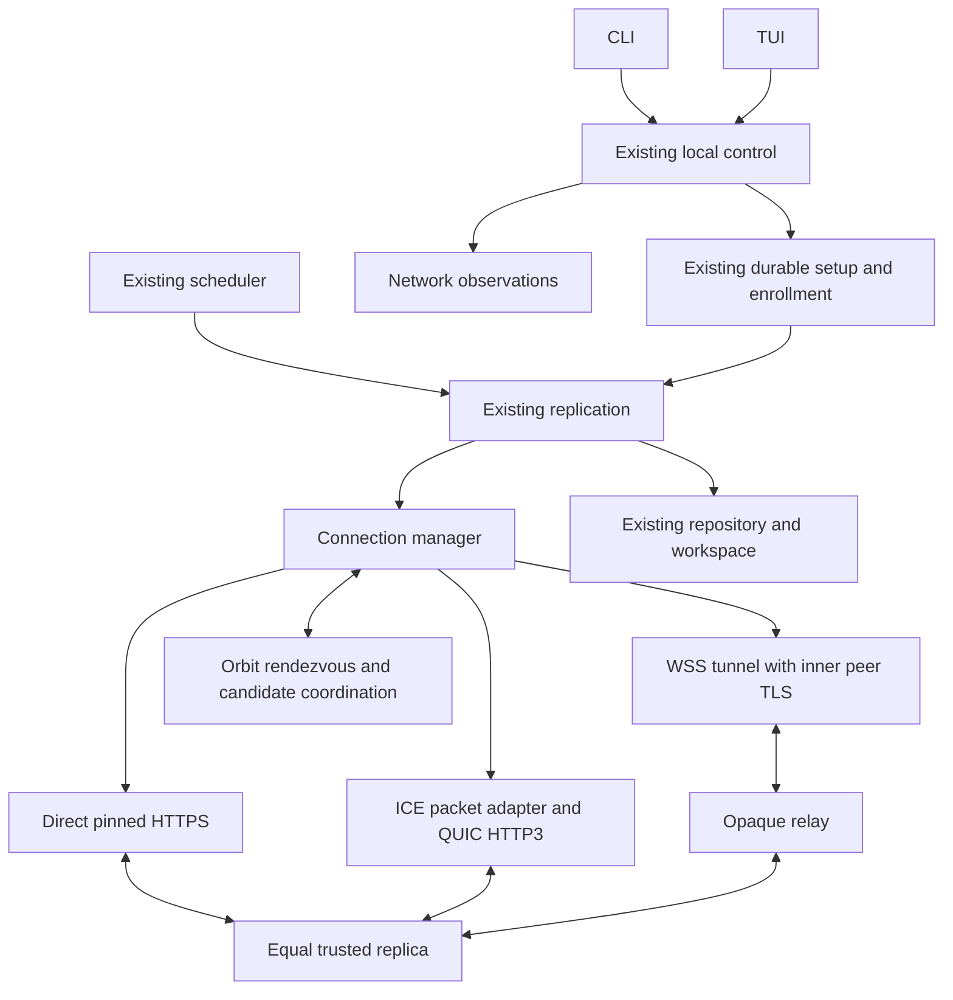

# Orbit native WAN architecture

Status: 2026-10-05: W01 adds contracts/adapters and local WG1–WG3 experiments;
[gate outcomes](implementation/wan-contracts.md) qualify that evidence. W02 integrates the daemon-owned manual HTTPS manager; W03 implements authenticated
rendezvous/profile services. W04 encrypted relay and W05 routed enrollment are implemented; W06 adds CLI
activation. W07 TUI onboarding and W08 LAN/direct TCP are implemented with qualified local evidence. W09–W16 add QUIC/ICE traversal, roaming, diagnostics, the operated service, packaged defaults and native WAN evidence; W17 (2026-10-07) reconciles this document with the implementation, and the per-packet sections below record what each integration established. [Scope](portfolio-scope.md) owns product direction; [plan](orbit-wan-implementation-plan.md)
owns sequence; [network protocol](orbit-wan-protocol.md) owns network encoding,
identity and admission; [gates](orbit-wan-design-gates.md) identify required proofs.

## Shape



Default services are operated infrastructure, separate from replicas. A relay
never becomes a folder member, stores file history or issues a durable receipt.
The optional trusted VPS replica retains authorized plaintext history and supports
forwarding without overlapping end-device availability. It may share a host with
an isolated relay process, with separate credentials, ports, resource limits and
administration. Nothing changes an existing VPS workload during planning or faults.

## Deep module and interface

Create a connection manager in `internal/network`. Its small caller interface
selects a transport for a logical target and returns qualified observations;
it hides discovery caches, candidate races, relay allocation, UDP traversal,
connection lifetimes, network generations and cooldowns. Existing replication
continues to own certificate pinning, per-request membership authorization,
enrollment proofs, chunk validation and receipt semantics.

Frozen W01 interface; exact Go types live in `internal/network/transport.go`:

```go
type Target struct {
    Device DeviceID
    Pin KeyPin
    Purpose Purpose // peer data or isolated enrollment
    Profile ProfileDigest // reviewed profile; empty for manual routes
}
type Manager interface {
    Transport(context.Context, Target, *tls.Config) (http.RoundTripper, error)
    Observe(Target) Observation
    Close() error
}
```

Transport instances are reusable, bounded and context-cancellable. Their target
identity/pin is immutable. Replication supplies the reviewed certificate/pin in its TLS configuration; clone
it and the root pool, retain its verifier and additionally check the immutable
target pin. The RoundTripper rejects http:// requests before dialing. A request's own context controls its attempt; manager
shutdown controls all work. Keep TLS configuration supplied by replication rather
than generating permissive verification inside the manager. Enrollment gets a
separate route/pool/handler set. The chosen `RoundTripper` preserves the standard
HTTP request/response and `req.TLS` properties required by existing peer handlers.
Receiving transport adapters feed only peer or enrollment HTTP servers, never
the loopback control handler. The supplied TLS policy already carries bootstrap trust; a second bootstrap
field is not needed. Separate purpose/profile pools remain required.

Direct HTTPS and relayed HTTPS are real adapters at the transport seam; HTTP3
is the UDP adapter. Keep internal protocol helpers private where only one module
needs them. `history`, `repository` and `workspace` do not import traversal libraries.

| Owning module | New responsibility |
| --- | --- |
| `internal/network` | Profiles, verified candidate cache, route selection, TCP/WSS/UDP adapters, observations, bounded lifetimes |
| `internal/replication` | Existing pinned TLS, peer HTTP semantics; v3 routed enrollment and safe transport injection |
| `internal/protocol` / schemas | Canonical signed network records and enrollment v3 fixtures |
| `internal/repository` | Additive durable network settings/peer routing references and reviewed setup records |
| `internal/control`, `controlclient` | Reviewed connection settings, named network queries and setup operations |
| `internal/app`, config, launcher | One daemon, manager lifecycle, isolated listeners, configuration loading |
| `internal/scheduler` | Existing durable jobs; fair retries over manager-provided transport |
| `cmd/filesync`, `internal/terminal` | CLI/TUI adapters, contextual setup, qualified network presentation |
| proposed `cmd/orbit-net` and server implementation | Rendezvous, relay and STUN deployment; no sync repository or owner control |
| scripts/packaging | Service packages, profiles, safe local network harness and native campaigns |

A single `orbit-net` executable may expose separately configured rendezvous,
relay and STUN listeners. Keep their implementations separable for testing and
deployment. Reuse established HTTP/TLS and STUN implementations. SQLite may store
service configuration/admission records if needed; transient candidate leases and
relay sessions do not require a replicated database, Redis or Kubernetes.

## Selected transport composition

### Relay milestone

Use public HTTPS/WSS with ordinary server-certificate verification for the outer
connections. A maintained Go WebSocket library supplying a binary `net.Conn`
adapter is the default candidate (`github.com/coder/websocket`). Both devices
connect outward. The broker joins bounded byte streams; pinned device TLS and
the existing HTTPS peer/enrollment exchange run **inside** that stream. The broker
terminates outer TLS only. It receives no invitation capability or folder bytes
in readable form. W01 pins coder/websocket v1.8.15 (ISC) and selects HTTP/1.1 WSS upgrade; do not assume the chosen
library has HTTP/2 extended-CONNECT support.

There is a persistent authenticated control connection per configured service
and on-demand data tunnels with finite admission. Explicitly reject nonempty
browser Origin headers; library defaults can allow same-origin browser clients.
Application authentication remains mandatory. The [executed W01 spike](implementation/wan-contracts.md#wg1--selected-composition)
found NetConn active-read deadlines incompatible with HTTP background-read
cancellation. The Orbit adapter supplies reversible read deadlines with one fixed
32,769-byte frame buffer, restores a finite frame cap after NetConn, and splits
writes. Invalid frames and cancellation close/join the pump. Copy with fixed
buffers, bounded library configuration and backpressure; close both tunnel legs
on cancellation/error. Relay admission tokens are short-lived, role/peer/purpose
bound and separate from folder invitations.

Attachment expiry is separate from established tunnel lifetime: a 30-second
reservation must attach promptly, while an admitted active tunnel may carry
requests for up to 60 minutes within its idle/quota bounds. Then drain the active
request to its finite deadline and close; later work opens a new session and
resumes at verified chunk boundaries. Credentials cannot renew enrollment.

### Direct UDP milestone

Preferred composition: Pion ICE gathers/checks host and STUN-observed candidates;
Orbit's authenticated rendezvous exchanges candidate messages. An established
ICE pair is exposed through a **packet-preserving `net.PacketConn` adapter** to
`quic-go`; native HTTP3 uses the existing peer HTTP handlers and pinned TLS.
Pion owns UDP reads. Never have ICE and QUIC both read the same raw socket.
ICE's Conn is a packet transport, not a reliable byte stream for `tls.Client`.

Use one quic-go transport to read each established ICE packet adapter and to both
listen and dial. Both devices serve their peer HTTP3 handler and may initiate a
separate QUIC client connection; this preserves the existing independent pull
direction on each device. ICE controlling/controlled roles do not determine HTTP
client/server roles or folder authority. WG4 must prove simultaneous listen/dial
and both pull directions through the same owned packet transport.

W09/W10 must prove the versions, adapter MTU/address/deadline/close semantics,
packet ownership, TLS pinning and HTTP handler limits. QUIC 0-RTT is disabled.
Map existing header/request/body/idle deadlines explicitly to HTTP3 support and
context/reader enforcement; net/http server timeout fields do not transfer
automatically to an HTTP3 server. Freeze adapter addresses for one generation;
an ICE selected-pair change closes/rebuilds the QUIC transport rather than mutating
its advertised addresses beneath a live session.
Enrollment initially remains HTTPS/WSS; HTTP3 serves only already-authorized peer
data and membership operations. The same existing `/peer/v1` encoding remains.
Default ICE uses host/srflx candidates and STUN; the WSS relay supplies fallback,
so TURN and WebRTC are unnecessary in the first release.

If the native HTTP3 composition fails its gate, the one bounded alternative is a
raw QUIC bidirectional stream adapter carrying existing inner TLS/HTTP. Record
and measure its double-TLS, MTU, closure and resource costs before replacing the
baseline. Unsupported combinations are not silently shipped. Dependency versions
and licenses are pinned from current official source by W01/W09; today's research
does not establish a compatible installed stack.

## Connection policy

Use the same persistent device ID/key across every route. Addresses locate a
device; they never confer identity, enrollment or folder membership. Maintain a
candidate set per device, service profile and purpose, with source, verified
signature, expiration, network generation and supported transports.

Cold connection default: start at most two eligible direct attempts, start relay
after a 750-ms head start if no authenticated direct path is ready, and bound an
initial connection cycle to 10 seconds. Existing connection-level/transfer
deadlines remain finite. Continue economical direct probing during relay use
(initially once per 60 seconds with jitter). Prefer authenticated direct paths
for new requests; drain existing in-flight work up to its existing deadline.
Route changes neither create new versions nor replay mutations under new IDs.

W11 tunes these planning defaults with recorded Pi/latency experiments. Freeze
finite values and expose Advanced controls; a numerical default is a bound, not
a performance claim. At most one traversal session and two live transport pools
per peer/purpose, bounded globally. Failed candidates get exponential cooldown;
failures retain categories rather than becoming a permanently preferred cache.

Detect interface/default-route changes and explicitly bump network generation.
Refresh leases, rebuild ICE pairs and probe existing paths. Do not assume seamless
QUIC/ICE migration. Validated old requests may finish; failed requests use existing
idempotency/chunk-boundary retry behavior. Flapping cannot generate unbounded jobs,
sockets, resolver calls or goroutines. Discovery outage does not tear down a valid
existing connection; expired discovery data cannot become permanent authority.

## Candidate and infrastructure trust

Service profiles provide versioned approved HTTPS/WSS origins, STUN addresses,
operator identity, authority key, privacy text and finite expiry. Distributed
profiles are signed; self-host profiles are explicitly selected/reviewed. Normal
TLS hostname verification remains mandatory for public service origins. DNS
resolution never chooses a peer's identity. A profile update cannot change device
pins or point at loopback control. Profile rotation uses the profile authority;
legacy defaults are not silently replaced with unrelated public servers.

Public rendezvous publishes only globally routable direct candidates plus relay
availability. LAN addresses travel through local discovery or authenticated
pair coordination with interface/scope checks. Reject loopback, unspecified,
multicast, broadcast, link-local without an explicit local interface scope and
ambiguous IPv4-mapped forms. Bound DNS resolution/rebinding and use reviewed
private-origin exceptions solely for self-host/manual modes. The relay connects
two admitted outbound clients and never dials a caller-provided URL.

Rendezvous registrations bind the existing random DeviceID **and** key pin with
proof of possession. The pair is the directory key; an arbitrary key claiming
another device's ID cannot overwrite its pinned entry. Peers query with their
known pin; a bootstrap invitation supplies the inviter's pin/certificate. No
trust-on-first-use from discovery results and no re-derivation of existing IDs.

## Durable and transient state

Durable: reviewed mode/profile, explicit manual candidates, known peer ID/pin,
capabilities, setup operation/attempt/root/approval phase and v3 route bindings.
Use additive schema/config migrations under existing exclusive ownership and
atomic writes. Keep `peers.json` v1 manual endpoints importable; do not mix newly
discovered addresses into its approval semantics.

Transient: candidate leases, sockets, relay reservations, ICE passwords, network
generation and diagnostics ring. Regenerate them after restart from durable
intent. Service restart invalidates its leases/reservations and clients reannounce.
Neither directory presence nor relay buffers imply durable file storage. Never
persist invitation plaintext in discovery or telemetry; use existing private
setup storage rules when a receiver needs the original invitation to resume.

## Evidence and unresolved integrations

[Design gates](orbit-wan-design-gates.md) require executable proofs, not new scope
interviews. The selected direction is fixed; workers close exact encoding/library
and adapter decisions with evidence. The [transport research](research/orbit-wan-transport-options-2026-10-05.md)
records primary-source capabilities and unexecuted integration questions. A local
spike is not production WAN evidence. Current T13, P17 historical pilot records
and deferred owner review remain visible in their original trackers.

## W02 manual manager integration

The daemon owns one `network.ConnectionManager`, shared by scheduler clients,
enrollment and bootstrap/control clients. Replication supplies TLS trust and the
existing handlers continue to authorize every request. Explicit v1 endpoints
become target-bound manual routes; changed endpoints invalidate new requests on
old pools while already admitted requests drain to their finite deadlines.
A competing pin cannot replace a known device/purpose route. Purpose-specific
pools retain enrollment's 10-second request/5-second header bound and peer data's
30-second request/15-second header bound. Both use 3-second TCP dials, a 10-second
TLS handshake cap, 16-KiB response headers and unchanged body/chunk validation.
Request URLs cannot redirect the dialer; redirects, plaintext and proxies fail.
Cached pools refuse changed roots/client certificates; every borrower's
`VerifyConnection` also runs on the authenticated socket before HTTP writes, so
reuse cannot bypass a stricter replication verifier.

Finite bounds: 128 explicit target/purpose routes (64 v1 entries plus enrollment),
32 reusable pools globally, two draining/current pools per target, two live TCP
connections per pool, 32 admitted HTTP requests globally and eight per target
including callers waiting for HTTP sockets. Pending TCP dials have an independent
32-global/two-per-target cap, retained across generation changes; cancelled HTTP
requests cannot create unbounded detached net/http dials. Owned sockets have an
independent 64-global/four-per-target cap, including detached TLS handshakes and
draining pools, so rapid route changes cannot escape pool admission. The HTTP request bound differs from
the two-per-peer relay tunnel bound: existing four-worker chunk transfers must
remain supported. Idle LRU pool eviction retains configured routes so all known
peers remain eligible under existing scheduler fairness. Overflow uses typed
backpressure and existing task/chunk retry identities and budgets. Observations
are bounded by imported targets and are passive, timestamped transport evidence;
they never assert a stored/applied receipt. Network generations discard stale
completion authority. Shutdown cancels and joins manager requests/dials, closes
active bodies and owned sockets, and closes pools before SQLite closes.

An absent private `network.json` means manual mode/generation 1 without writing
state. Its optional frozen policy record is strictly validated; this packet
activates only manual mode with LAN advertising off. Other reviewed modes return
an explicit unsupported-capability error until their owning integrations arrive.
There is no database/schema migration, identity/counter rewrite, peers.json rewrite,
global announcement or network capability advertisement. Stopped/live controller
selection is unchanged. W03 owns service profiles/leases; W08/W11 own discovery,
network-change detection, competing-route races and roaming. W02 tests manual
generation/draining semantics against the independent WG5 model; WG5's final
native timing/roaming closure remains W11.

## W03 directory and profile integration

`internal/rendezvous` is the production ephemeral service; `cmd/orbit-net` runs
its bounded TLS listener separately from the sync daemon. It imports no repository,
workspace, enrollment, folder or owner-control handlers. `network.ServiceClient`
uses the frozen HTTPS exchanges and one authenticated WSS reader per purpose.
Caller-selected known pins gate received data offers; unknown enrollment offers
use a separate two-session budget. A directory candidate is never reported as
reachable and is not installed into the manual manager. W04/W05/W08 own route
attachment/enrollment/direct dialing; W06 owns reviewed setup activation. The
existing app still activates only manual/no-advertising intent and advertises no
new network capability. Saving a profile alone sends no network traffic.

Service bounds: 256 accepted sockets before TLS/HTTP goroutines; 128 active HTTP
exchanges separately from 128 WSS controls (including unauthenticated upgrade
handshakes); one control per exact identity/pin/purpose; eight queued addressed
events per control; 128 challenges (two per key); 128 signed purpose-scoped lease
records; 128 sessions, including at most two enrollment offers; 1024 live replay
entries. At capacity reject new work rather than evicting replay protection.
Per-key metadata rate is one/second, burst ten. Pre-auth global rate is 128/second,
burst 128; source-IP challenge rate two/second, burst 128, at most 128 source buckets.
Per-key rate buckets cap at 1024. A forwarded header never supplies an exemption.
The larger shared-NAT burst permits independent devices to register together;
this is finite admission, not immunity to infrastructure denial of service.

All announced/offer candidates are public numeric addresses; this public directory
refuses LAN/loopback/control-target addresses even with self-host outer TLS trust.
Offers bind both pins, purpose, session, two generations and role. Acceptance must
reverse that exact pair/generation tuple; reservations require acceptance and give
one service-signed credential for the requesting leg. The 30-second reservation
expires from the original offer, without renewal by replay. Tokens bind the fresh
restart epoch; W04 must check live reservation/epoch before attaching/forwarding.
No relay endpoint/forwarding or relay availability is implemented by W03.

Profiles use independently reviewed authority, signed epoch/digest and explicit
`release`, `self_hosted` or `development` provenance. Private origins require the
latter two, never loopback. Normal TLS verification uses system roots or explicitly
supplied cloned roots; no skip-verification/proxy/redirect option exists. Every new
socket resolves with a three-second context, rejects empty/over-16/mixed unsafe DNS
answers, and dials only checked numeric addresses while retaining the original TLS
hostname. Default DNS uses Go's context-aware resolver. Client exchanges, detached
dials and owned sockets have independent limits of four, four and eight, respectively;
close cancels/joins requests, dials and WSS readers and closes sockets/pools.

One service sweeper removes expired metadata at one-second intervals without
requiring incoming requests. No application or HTTP/TLS error logs retain addresses,
identity/certificate bytes or timing. Routes last at most 600 seconds, challenges
60, replay entries 300, offers/reservation credentials 30; rate buckets expire after
60 seconds of inactivity. Connected controls retain authenticated identity and
queued events only until closure. TLS headers/body deadlines are 5/10 seconds;
application body read/write work uses five-second deadlines. WSS admission allows
16 KiB and ten seconds; writes/pings use five seconds. Heartbeat is 25 seconds;
clients require application heartbeat/event progress within 75 seconds.
Reannounce is one synchronous worker at 120 seconds ±20 seconds, advancing lease
generation, with one same-operation/same-payload retry after uncertain delivery.
No timers or retries extend folder invitation or approval expiry.

These are measured local admission/lifecycle bounds, not hosted capacity claims.
W13 owns real origins/operator signer custody, external infrastructure logs and
retention, monitoring, egress budgets, profile distribution/rotation and packaging.

## W04 encrypted relay integration

`internal/rendezvous` now admits `GET /network/v1/relay` on the approved same-host
WSS origin. Each leg sends a bounded signed attachment with a fresh HTTPS-issued
challenge. The proof binds the WSS origin, restart epoch, exact live service-signed
credential, device/partner pins, session, purpose and role. Acceptance by the
partner is mandatory. A role is occupied under the service lock before its
acknowledgement; a second connection cannot reuse it. Invalid credentials cannot
cancel somebody else's live stream. Valid capacity refusals release their pending
session. Explicit release, expiry, profile expiry, leg loss, frame error, quota,
idle timeout and shutdown cancel both legs and join owned readers/forwarders.

Unknown enrollment initiators may have an authenticated control channel without
announcing a public directory record. Their partner's acceptance uses the exact
live offer/session/generation and addressed control channel. Data still requires
both registered generations and reviewed local pins. The relay imports no folder,
content, repository or owner-control package and never dials a supplied URL.

Bounds: 128 total live intents/tunnels, 64 data tunnels, two enrollment tunnels,
eight data tunnels per device and two per exact peer pair; 132 pre-authentication
relay handler slots are independent of the 128 metadata and 128 control slots.
The existing 256 pre-TLS socket ceiling is shared by all service traffic, so these
are independent ceilings, not a promise that every maximum fits simultaneously.
The daemon client caps eight data/two enrollment legs, two per peer/purpose,
four metadata operations/dials and 14 total owned infrastructure sockets (controls,
metadata and upgraded legs). A full socket table returns bounded backpressure.
Metadata keepalives can be closed independently of upgraded connections.

Forwarding has two 32-KiB copy buffers plus the existing fixed frame/read-pump
buffers, with disabled compression and a 32-KiB binary-message cap. Initial
aggregate/per-device ciphertext ceilings are 20/5 MiB/s, each with one 32-KiB
burst. Both directions charge both participating devices. Buckets persist across
reconnections for 60 seconds of inactive use, at most 1,024 keys, and are removed
only when no live session references the stale key. A tunnel has a finite 16-GiB
aggregate ciphertext budget. Byte accounting reserves before forwarding; quota
waits respect cancellation and the write/idle deadline. Limits are operator
configuration, not measured hosting capacity.

Unused attachments expire after 30 seconds. Paired streams have a separate
60-minute lifetime and 60-second idle bound. The manager refuses a retired pooled
socket before starting new HTTP bytes; already admitted finite requests have at
most a 30-second drain grace. The opaque broker cannot determine HTTP request
boundaries, so it enforces a hard lifetime-plus-grace closure instead of attempting
to parse requests. Client timers also enforce that ceiling. Profile expiry and
faults close immediately rather than granting a drain-based authorization extension.
Subsequent transfer retries open fresh sessions and retain verified chunks.

`network.RelayEndpoint` supplies bounded offer/accept/reserve/attach coordination
for one purpose and a caller-owned announced generation. Its event queue/workers
and outgoing acceptance waiters are bounded separately for data and enrollment.
Announcement renewal, service reconnection and rebuilding on network generation
changes remain the policy/runtime owner's work in W05/W11. `SetRelay` installs
an explicit logical origin into the existing manager: replication supplies the
same pinned TLS, request authorization, receipts and scheduler retries as manual
HTTPS. Actual successful inner HTTP requests produce `relay` observations;
bounded typed service errors preserve overload/offline codes. Connection allocation
and forwarding acknowledgements never touch receipt persistence.

The daemon now serves separate manager-owned virtual data/enrollment listeners
with the existing TLS handlers and joins them before SQLite shutdown. These
listeners have no externally reachable address and no owner-control purpose.
Default manual startup still selects no service and sends no announcements;
profile saving alone does not activate networking. W05–W07 own durable logical
routes, v3 handlers and reviewed CLI/TUI activation. No bundled hosted profile or
QUIC/ICE capability is advertised by this packet.

Service exchanges deliberately retain cancellation/deadlines while dropping
peer request context values. In particular, the manager's inner-TLS `httptrace`
verifier must never run on the outer service TLS socket. The W04 production sync
experiment exposed this boundary and verifies its repair with actual transfers.
[Local acceptance](evidence/wan-w04-20261005/summary.md) records executed limits,
seeded versus complete coordination fixtures, failures and native limitations.

## W06 CLI control integration

Network preview/apply and optional setup policy use the existing terminal ledger,
private state writers and authenticated shared client. CLI code owns presentation
and reviewed files; the daemon retains transport, enrollment and sync ownership.
Desired/active policy differs until a completed daemon restart; the CLI can replay
an accepted apply after an interrupted restart. Missing/invalid profile blocks
service activation while retaining the daemon's local capture/control lifecycle.
Automatic awaiting a real profile is explicit incomplete intent. Local-only
stops global service traffic and WAN pools while retaining permitted local
discovery/direct paths; W12 exposes the resulting qualified status and doctor
codes without probing from passive reads.
Routed modes use a five-second default reconciliation cycle for newly admitted
roots/peers, retaining the existing bounded scheduler and five-minute manual
cycle. W11 owns native timing/fairness refinement. No new TLS, membership,
receipt, QUIC/ICE or operated-default guarantee follows from these controls.


## W07 TUI control integration

The existing Bubble Tea model retains one asynchronous lane, generation/request
matching and controller-owned enrollment/recovery. The CLI launcher observes fresh
installation before creating the daemon identity; the TUI offers Automatic only
for that first review. Existing reviewed policy remains selected. Confirmation
binds connection policy to the same root preview and durable setup/job as the CLI;
Back/Edit and Local network only precede activation. Advanced retains manual
numeric endpoints, budgets and concurrency. Independent profile/TLS trust uses
`orbit network preview/apply`; invitation profile context never installs trust.

Private v2/v3 paste/file input and deliberately revealed versioned transfer codes
use the existing invitation contract. Revocation hashes the deliberately held
capability through the shared authenticated client's existing controller operation.
No new enrollment protocol, membership authority or receipt boundary is introduced.
Explicit same-request retries retain mutation/attempt identity; periodic queries
never resubmit a mutation. Request/folder selections survive reordered polls;
late results cannot replace another view or resurrect a closed workflow.

Setup progress and Connection details query cached network status separately from
local readiness and copy observations. Relay status includes the actual observed
time; service readiness never implies files stored/applied. Query failures label
retained observations as unavailable currently. TUI exit restores terminal modes
and leaves accepted daemon work running. Hosted/default profiles, direct traversal,
roaming and inherited T13 native lifecycle checks remain later acceptance.

## W08 direct TCP and local discovery integration

The daemon starts an optional peer-data TCP listener in nonmanual modes, bound to
`:0` by default (kernel-selected unprivileged port, IPv4/IPv6 where supported).
It serves the existing pinned mTLS peer handler only. Failure to bind or select
an interface is a route limitation; capture, owner control and reviewed relay
runtime continue. Explicit manual listeners keep mandatory startup failure.
Optional incoming TCP admission is capped at 64 sockets before TLS/HTTP workers;
existing handshake/header/body/request deadlines and membership checks remain.
No firewall/router/interface configuration is modified by the daemon.

Private `direct-network.json` supports `interfaces` (up to eight exact interface
names), numeric `listen`, and `disabled`. Missing settings select up, multicast
capable nonloopback interfaces and `:0`. Selected interfaces supply actual bound
ports and private LAN or eligible global IPv4/IPv6 addresses. LAN candidates never
enter directory announcements; public candidate gathering never uses the directory's
observed source port. IPv4 multicast carries same-interface private IPv4/ULA IPv6
candidates. IPv6-only LAN multicast is not implemented; globally reachable IPv6
TCP can use signed directory records, and explicit scoped local routes remain.

LAN advertising is a reviewed policy field. Fresh CLI/TUI setup selects it for
Automatic or Local-only, shows device/pin/address visibility in review, and retains
existing reviewed choices. `orbit network preview --lan-advertising=true|false`
uses the existing exact preview/apply ledger and restart requirement. Manual stays
no-advertising. Local-only constructs no service client, consumes approved peers
through LAN discovery or permitted explicit local endpoints, and filters both
remote and destination private/interface scope before incoming TLS. Configured
local enrollment stays isolated and pinned; discovering a device never enrolls it.
Fresh Local-only pairing still needs the explicit legacy local enrollment settings;
ordinary WAN invitations continue through the existing approved v3 relay flow.

One discovery UDP socket joins only selected interfaces at `239.255.79.66:22027`,
TTL 1, with actual received-interface packet metadata. There are two fixed joined
workers, a 1,201-byte receive buffer plus 128-byte ancillary buffer, and at most
20 admitted datagrams/second before identity/signature work. Unknown identities
are dropped without caching. Signed records have no folders/secrets, at most four
TCP candidates per datagram and ten-minute expiry. Announce at startup, five and
ten seconds, then every 120–135 seconds. Oversized/truncated records are discarded.
Source and candidates must belong to receiving-interface private prefixes; remote
interface names are signed labels, rather than assumed local interface names.

Approved peers also exchange these records inside their pinned session, so a
host firewall that drops inbound multicast and direct traffic on one device no
longer forces the relay. One sequential worker per daemon refreshes connected
peers every four minutes. Peer-sent leases are scoped to the local interface
whose prefix contains them, exclude the receiver's own addresses, are capped at
four candidates per target and never suppress the public lookup
([protocol](orbit-wan-protocol.md#peer-lan-exchange-post-w17-2026-10-07)).

The manager holds independent LAN interface leases and public leases, capped at
16 combined candidates per reviewed target, 128 reviewed routes, and 1,024 LAN
scope/generation tombstones. Expired candidates cannot initiate a dial; expired
LAN bodies are cleared during replacement without discarding bounded replay floors.
Updates on one interface cannot renew another's expiry/generation. A cached live
TLS session stays usable without directory access or a renewed candidate lease.
Candidate updates do not change pins, membership or in-flight receipt authority.

TCP races alternate address families with a 200-ms second-attempt delay, at most
two candidate attempts per peer, existing global 32 raw dial and 64 owned outgoing
socket ceilings, and a three-second direct-only budget. With relay configured,
direct handshakes receive the existing 750-ms head start; failed routes then use
pinned inner TLS over the reviewed relay. A full standard certificate/pin/ALPN
handshake wins, never a TCP accept. Losing sockets close and workers join. Manager
shutdown owns complete candidate/TLS attempts as well as raw dials and requests.
Actual socket provenance supplies direct/relay observations after authenticated
HTTP, separately from stored/applied receipts.

A live empty signed public lease is cached too: repeating it must not consume
lookup quota. Relay fallback can reuse that same verified target announcement;
its fresh offer/accept/token proofs still enforce the live exact generation/session.
The cached lookup is dropped on stale-generation/route-unavailable refusal. This
reduces duplicate metadata work without extending leases or session authority.
The documented five-second daemon cadence is the W08 binary acceptance setting;
one-second forced retry/restart experiments exhausted service metadata admission
and are uncredited. W11 still owns cooldowns, service-generation recovery, direct
reprobes while relayed, native roaming and measured timing/fairness tuning.

## W09 native QUIC HTTP3 integration

Selected stack: quic-go v0.63.0 / qpack v0.6.0; Pion ICE v4.4.6 is pinned and
compiled by the packet-contract test. All are MIT; full dependency/license/API
provenance is in [W09 audit](evidence/wan-w09-20261006/dependency.md). Production
ICE establishment remains W10. Native HTTP3 passed the handler seam, so the raw
QUIC-stream/inner-TLS alternate is unnecessary.

Non-manual daemons optionally bind UDP `:0`, independently of optional TCP.
`direct-network.json` adds optional `udp_listen` and `udp_disabled`; existing
`interfaces`, `listen`, `disabled` settings retain their required-field semantics.
`disabled` disables both direct listeners. Bind failure preserves TCP/relay/local
capture. Local-only resolves wildcard UDP to one selected concrete interface
address and filters private source addresses against that address's prefix before
QUIC admission. This one-address local UDP limitation does not remove TCP's
existing interface/family coverage. No internet services or firewall changes occur.
Actual bound UDP ports join signed scoped LAN/public advertisements using additive
`quic_http3_v1`; this capability does **not** advertise ICE/STUN support. Existing
TCP-only signed fixtures are unchanged. Enrollment/control never enter HTTP3.

Each `QUICEndpoint` has exactly one `quic.Transport` reading its socket; that
transport both listens and dials separate peer HTTP3 connections for both pull
directions. One endpoint is attached to the manager before scheduling. Pools
retain cloned replication roots/certificates and immutable target pins, verify
TLS 1.3/h3 before HTTP, and recheck each borrower's verifier before cached requests.
Server requires a client certificate; the existing handler enforces the exact
DeviceID/SPKI/folder/revision on every request, including reused connections.
Normal `Listen`/`Dial`, explicit `Allow0RTT=false`, no client session cache and
server session tickets disabled preclude early data.

HTTP3 limits are mapped explicitly, not inherited from net/http: 32-KiB request
headers, stream read deadline five seconds **before** parsing; body read deadline
15 seconds after header parsing; response write and handler-context deadline 30
seconds; HTTP3 and QUIC idle timeout 30 seconds; handshake idle five seconds.
Client response headers: 16 KiB and 15 seconds; manager's 30-second request
context remains active through streamed body close. Existing 8-MiB metadata and
manifest-scoped fixed-size chunk bounds remain in replication.

The exported HTTP3 raw server connection handles Orbit-owned accepted streams.
Orbit supplies pre-parser deadlines and joins request/control workers on close;
quic-go retains HTTP3 parsing/QPACK/TLS/request construction. At most 32 incoming
sessions (including handshakes) are admitted, after mandatory source-address Retry;
each connection allows two request streams/four unidirectional control streams.
Manager bounds remain 32 pools/requests and two pools per target; QUIC pools add at
most one outgoing connection each. Receive windows start at 64/128 KiB per
stream/connection and cannot grow above 256/512 KiB. Fixed packet MTU is 1,200,
with path-MTU discovery disabled. HTTP datagrams are disabled. These are bounds,
not Pi/production capacity measurements.

`PairPacketConn` accepts only numeric established-pair addresses, copies them
for the generation, reads a complete datagram into one 64-KiB scratch buffer,
refuses >1,200-byte or truncated input, restricts destination writes, delegates
reversible deadlines/closure and rejects observed pair-address changes. W10 must
close/rebuild on its actual selected-pair callback before publishing a changed pair;
the adapter never makes raw ICE a TLS byte stream or reads Pion's raw socket.
Tests use actual UDP sockets behind a synthetic pair, including packet loss and
duplication. They do not establish ICE-role conflict/NAT traversal acceptance.

W09 tries a complete pinned QUIC handshake within the existing 750-ms direct
budget, then may use preserved TCP/WSS only **before** HTTP submission. It never
replays a failed HTTP3 request into TCP. Mixed family/transport races, negative
cooldowns, direct reprobes, ICE session deduplication, interface generations and
roaming/fairness remain W10/W11. Observations use `quic` with dated connectivity;
normal TUI wording remains Direct connection, separate from receipts/readiness.

## W10 authenticated ICE integration

W10 composes pinned Pion ICE v4.4.6 with W09's packet transport and unchanged
replication HTTP3/TLS handlers. `RelayRuntime` activates ICE only with reviewed
Automatic/self-hosted service intent and an enabled UDP setting. Local-only and
manual modes perform no ICE coordination or STUN traffic. Initial enrollment
retains its isolated HTTPS/WSS path. `ICEOptions.Net` is a socket-backend seam for
disposable in-process emulators; the daemon leaves it nil and uses OS sockets.

The existing purpose-specific authenticated control channel carries an optional
signed `ice` offer extension. The smaller `(DeviceID, pin)` is the controlling
offer initiator. A larger peer sends a credential-free signed request, which
reuses an existing controlling offer for that target/generation tuple. Concurrent
pull directions share one pair while opening independent pinned QUIC connections.
The service checks both announcement generations and both identities; acceptance
must match session, opposite role, ICE mode and both generations. An ICE session
cannot reserve a relay attachment. Failed traversal uses a separate relay session.

Each coordinator admits eight resident pairs and two simultaneous establishments;
all work is joined. Gathering uses at most two selected interface addresses, four
reviewed numeric STUN endpoints, UDP4/UDP6 and host/srflx types. mDNS, ICE TCP,
TURN and router mappings are disabled. Gathering has a three-second STUN budget
and a four-second outer completion bound; checks have five seconds and seven
binding attempts per candidate pair. The complete coordination/gather/check cycle
has twelve seconds. Local gathering precedes coordination in both roles: an empty
local set fails immediately instead of awaiting an unusable remote offer. No more
than eight canonical candidates enter an offer.
A larger gathering set fails closed rather than publishing an unbounded list.
Private host and related-address topology never crosses the service; host/srflx
public targets pass the same prohibited-scope checks before Pion receives them.

Native raw UDP sockets request 64-KiB read/write buffers. A socket wrapper admits
at most 32 public source address/port tuples plus exact reviewed STUN servers,
100 STUN packets per second per socket, and 1,200-byte datagrams before Pion can
allocate peer-reflexive candidates. Unsupported buffer tuning is explicit in the
virtual backend; native Linux socket requests execute. Pion's application packet
buffer remains capped at its pinned one-MB default. The maximum gathering socket
count is ten per agent (two host plus two selected addresses times four STUN endpoints),
with eight resident agents; this is a finite component bound, not a measured Pi
capacity or the W11 combined network budget. Native and all ICE HTTP3 endpoints
share the daemon's 32-session incoming QUIC admission channel. Existing manager
request/TCP/tunnel caps remain in force.

Only Pion reads its raw sockets. `PairPacketConn` freezes the established selected
pair; one QUIC transport owns its sole application reader and both listen/dial
directions. A selected-pair change, ICE disconnect/failure, generation retirement
or shutdown invalidates the pair and closes its HTTP3 transport. Cache retirement
precedes endpoint closure so a subsequent dial cannot borrow a closed pair.
Pion callbacks signal retirement; joined workers close it outside Pion's callback
loop. A new attempt creates fresh credentials and sockets; in-flight failure uses
the existing safe replication retry/chunk rules. No seamless migration is claimed.

A pool tries ICE once after native direct QUIC fails. After an establishment
failure it uses preserved TCP/WSS for the pool lifetime; manager generation changes
rebuild pools. W11 owns timed reprobes, mixed races, interface detection and policy
cooldowns. `ConnectionManager.ICEFailure` retains a typed establishment failure
(`ICE_NO_CANDIDATES`, `ICE_CHECKS_FAILED`, `ICE_QUIC_UNAVAILABLE`, or a service
failure) separately from the successful fallback's route observation. It never
labels a NAT class from a timeout. W12 owns its presentation. HTTP requests are
submitted only after pinned TLS; a submitted request is never replayed into a
second transport by this adapter.

The separately exposed optional STUN listener uses the maintained STUN codec and
returns only XOR-MAPPED-ADDRESS. It admits 10 requests/second per IPv4 /24 or IPv6
/64 and 200/second globally, with 1,024 retained prefixes and a 60-second idle
sweep. A single worker reads at most 1,024 bytes, refuses requests over 128 bytes,
nonbinding/malformed requests and attributes other than a valid fingerprint.
Responses are at most 128 bytes and three times request size (actual minimal IPv4
32/20 and IPv6 44/20); writes have one second. There is no alternative-server,
CHANGE-REQUEST, file handler or relay allocation. W13 owns deployment and operated
profile availability; no hosted endpoint is invented here.

Pair lifetime belongs to `RelayRuntime`, independently of a reconnecting directory
control endpoint. A control-channel/service outage marks service readiness false
but retains authenticated ICE pairs with live consent. The next successful control
attachment/announcement generation retires old pairs; runtime shutdown still
cancels and joins all pair workers before repository shutdown. An actual service
shutdown fixture continues capturing and transferring verified bytes over ICE.


Prompt no-candidate fallback can expose the unchanged service metadata burst
quota across back-to-back fresh relay pools. W10's native fixture records the typed
refusal and succeeds after a bounded five-second quiet refill; one-second retries
consume tokens before accumulating enough for lookup/offer/reservation. No quota
is enlarged. W11 owns production cooldown/retry fairness and the combined budget;
this composition evidence does not claim immediate unlimited fresh relay setup.


## W11 route-policy and roaming integration (partial)

W11 adds an authenticated handshake race before peer HTTP submission. Native QUIC
and pinned TCP race concurrently, with a 200-ms TCP stagger when native UDP
is also advertised; absent usable TCP candidates, relay waits the
750-ms direct head start. TCP and QUIC each stagger address families by 200 ms,
with a **shared** global 32 / per-target two outgoing handshake budget. QUIC
connections still require h3, complete pinned TLS and no early data. Exactly one
transport receives a request; neither a losing handshake nor a route switch
replays uncertain HTTP delivery. Request admission bounds remain 32 globally/eight
per target, two pools per target, 64 outgoing TCP/tunnel sockets, 32 incoming QUIC
sessions, eight ICE pairs and two ICE establishments. These are component bounds,
not combined peak-memory/Pi capacity measurements.

Idle relayed pools reprobe after 60 seconds. Failed direct cycles receive
60/120/240-second cooldowns plus deterministic 0–15-second peer jitter, capped at
240 seconds before jitter. Local retry attempts cannot slide a cooldown. A changed
authenticated candidate set or actual network change clears negative routing state;
a closed once-usable QUIC connection can rebuild immediately when no negative
cycle is active. An ICE waiter canceled because another route won is recorded as
`ICE_PROBE_DEFERRED`, without claiming checks failed or assigning a NAT class.
Runtime-owned ICE establishment remains bounded and may finish for a later probe.
Direct reprobes are demand-driven; idle devices do not open periodic peer requests.

A typed service quota refusal starts a shared five-second quiet period for that
runtime's outbound lookup/relay/ICE/announcement operations. Scheduler quota
retries retain the existing task and wait at least five seconds. Inbound relay
workers can retry each explicitly quota-refused accept/reservation/attachment once
after five seconds, within their existing 30-second attachment deadline, using
the original session/role/generations. No unknown delivery or peer HTTP mutation
is retried here. This addresses a remote attachment refusal that otherwise leaves
the initiator waiting for inner TLS. Limits and service quotas are unchanged.

Prepared enrollment throttling also preserves the original proof: retry a
refused submit after 25 seconds only when more than 25 seconds remain in its
signed deadline. Successful authenticated submit state avoids two redundant
immediate possession-status requests; subsequent scheduled polls and lost-response
recovery retain their original semantics. No proof is regenerated or extended.

One joined daemon watcher samples eligible interface addresses/indices and Linux
IPv4/IPv6 default routes every two seconds, reads at most 64 KiB per route file,
requires two equal changed samples and admits at most one callback per five
seconds. Sampling errors retain the last observation. Real changes invalidate
address leases and old observations, retain candidate generation floors, drain
bounded old pools and reject delayed lookup/ICE observations. LAN discovery is
recreated with actual interfaces/ports. Runtime announcements coalesce per purpose
and rebuild ICE generations. Local-only listener scopes refresh and its concretely
bound UDP endpoint is replaced. Automatic wildcard native sockets are retained;
explicit address binds remain explicit and may become unavailable after roaming.
Manual mode has no new watcher/service traffic. Policy, pins, membership, operation
IDs, histories and ICE secrets are never persisted by the watcher.

Queue aging now forces ready work after eight skipped dispatches before comparing
file size. Dispatch resets durable age, including before later retry/reload, so
one repeatedly failing large task cannot inherit permanent priority. Folder
round-robin and existing route-independent replication bandwidth/chunk verification
remain authoritative. The synthetic 1-TiB task test proves queue selection and
identity retention, **not** actual large/small network throughput fairness.

[Evidence](evidence/wan-w11-20261006/summary.md) records native TCP/QUIC chunk and
receipt recovery, real isolated interface/default-route detection, quota/NAT
regressions and busy-generation bounds. WG5 remains open: Advanced timing controls,
Pi/latency/loss tuning, complete daemon Wi-Fi/relay-switch journeys, slow DNS/relay
campaigns and measured mixed-transfer bandwidth/resource fairness remain required.


### W11 reviewed route timing and fair bandwidth reservations

The private `NetworkPolicy.timing` object adds optional decimal-string millisecond
fields. Missing/zero fields retain finite defaults. `head_start_ms` defaults to
750 (250–3,000), `cycle_ms` to 10,000 (5,000–30,000), `probe_ms` to 60,000
(10,000–300,000), `cooldown_ms` to 240,000 (probe interval–900,000), `poll_ms`
to 2,000 (500–10,000), and `quiet_ms` to 5,000 (2,000–30,000). Cycle must cover
two head starts; quiet period must cover polling. Cooldown includes the existing
0–15-second stable peer jitter after its configured cap. Service quota refill,
ICE establishment, invitation/proof expiry and authentication bounds remain fixed.

`orbit network preview --review-file PRIVATE_FILE` accepts Advanced duration flags
`--direct-head-start`, `--connection-cycle`, `--direct-probe`, `--direct-cooldown`,
`--network-poll`, `--network-quiet`. Omit `--mode` to retain current policy. Whole
nonnegative milliseconds are required; zero restores the corresponding default.
The existing preview/apply ledger binds exact timing, current policy and generation;
apply activates changes by daemon restart. Desired/active timing is exposed in
cached status. TUI network details point to this shared reviewed control flow.
Timing never supplies remote authority or expands an invitation deadline.

Replication reserves each manifest chunk's bytes before every primary/fallback
network attempt. Uncertain delivery and retries consume budget. The global/per-peer
limiter serves at most 128 waiting reservations in arrival order; cancellation
removes the waiter and wakes the next one. Overflow is retryable `NETWORK_BUSY`.
This prevents repeated tiny reservations taking every refill ahead of a large
waiting chunk; one slow peer can delay later reservations until its finite request
is admitted or canceled. A configured limit governs scheduled pull chunk payload attempts, with
a one-second initial burst; protocol/control overhead is additional. Serving a
remote peer remains subject to the existing request/stream quotas rather than
this local pull limiter. This is not
a strict interface-wide bandwidth cap. Queue aging and verified-chunk/receipt
semantics are unchanged. W11 evidence must separately record measured progress
and combined process resources on the declared host.


W11 CLI setup/join waiting retains the last known durable operation after a
read-only control status timeout and retries observation within the original wait
deadline. Each query shares that deadline and the existing RPC limits. Authentication
and non-timeout refusals remain errors. The waiter never resubmits a mutation or
replaces an operation/invitation/proof; expiration reports pending state without
claiming Ready. This handles a slow or reconnecting daemon whose background join
can outlive one control query. Exact wait-deadline and refusal regressions plus
real legacy/routed CLI journeys are recorded in W11 follow-up evidence.


### W11 completion and measured defaults

[Completion evidence](evidence/wan-w11-followup-20261006/summary.md) supersedes the
historical partial state above. Initial finite defaults are retained after actual
Pi 4B production-default 25 ms/1% loss roaming: relay→QUIC 26.12 s, network detection
3.59 s, direct→relay 7.47 s and final relay→QUIC 49.18 s in that fixture. Reviewed
500 ms poll/2 s quiet/10 s reprobe settings separately pass locally and on Pi.
These are measurements, not universal reconnection deadlines. Existing Pi runtime
concurrency two is used; no host sysctl/governor/service setting is altered.

WSS/TCP/HTTP3 mixed-peer 16 MiB and continuous-small transfers have actual progress
and combined process socket/RSS/FD/heap/goroutine/CPU evidence, alongside component
admission and 32-peer slow DNS/relay cancellation. WG5 closes and M3 is satisfied
for the declared native isolated/local/Pi conditions. Operated-default profiles,
physical WAN and combined release/native lifecycle remain later packets.

## W12 diagnostics and privacy boundary

The control layer owns two read paths. `network_status` reads the manager's
cached observations, profile/policy state and durable readiness fields; it never
starts DNS, directory, relay, direct or UDP work. `network_doctor` is an explicit
single-peer operation with a 20-second outer budget and finite resolver, dial,
TLS and STUN deadlines. It emits typed `ProbeResult` records for service DNS/TCP,
service TLS, authenticated directory, pinned direct TLS, pinned relay-inner TLS
and actual STUN binding. A successful STUN response proves only that response;
the implementation deliberately does not classify NAT or firewall behavior.

Direct/relay doctor probes construct the existing pinned transport trust and
perform only a TLS handshake, never an HTTP request or route-observation write.
The directory check uses the authenticated service client and the selected
device identity. A peer is probed only when the operator supplies its ID; no
status screen fans out across peers. Missing, canceled, expired, policy-disabled,
quota, identity and timeout outcomes retain separate codes and plain next
actions.

Applying Local-only or Manual policy closes service/relay clients, invalidates
WAN leases and drains WAN pools before the mutation completes while the control
daemon remains available to report the required restart/active policy. Keys,
identity, peer history, membership, roots and files remain. Existing installs
do not acquire internet defaults without reviewed consent; first setup records
the choice in the same policy review. Self-hosted profiles use the same TLS and
per-peer pin validation as operated profiles.

Support export is an allowlisted projection of configuration and diagnostics.
Nested messages, remediation strings, task errors, event phases and retry causes
are reduced to stable support codes or deterministic path pseudonyms. Archive
creation uses exclusive creation, so an existing archive cannot be overwritten.

## W13 operated service and self-hosting

`orbit-net` is a separate operator binary with `serve`, `keygen`, `profile sign`,
`profile verify` and `version`. `serve` reads one strict owner-only JSON
configuration (flags override it) and validates everything before opening a
socket: profile signature/expiry, service key match, origin membership, a
currently valid TLS chain covering the origin host with an owner-only key, STUN
membership, a numeric loopback metrics address and positive budgets with the
per-device rate at most the aggregate. Behind 1:1 NAT, `stun_bind` names the
local UDP socket while `stun_listen` stays the reviewed public address. `--check` stops there. SIGHUP reloads the
chain through `GetCertificate`; a rejected reload keeps the current certificate.
SIGINT/SIGTERM close controls and relays, then drain HTTP for five seconds.

Rotation overlap: `rendezvous.Options.Overlap` serves at most one adjacent epoch
(two total) that shares the authority, environment, HTTPS origin and relay
origin. Each request is admitted under the epoch named by its proof; challenges,
relay credentials and attachments are bound to and signed with that epoch's
service key. Expiry is per epoch: sessions and directory records of an expired
epoch are dropped while the other epoch continues. The service refuses all work
only when every served epoch is invalid. Restart still discards every lease.

Clients accept a peer's announcement proof or offer made under another
well-formed profile digest when its origin equals their own. The service admits
only epochs it serves under one authority/origin, and device authenticity still
comes from signed proofs and pinned inner TLS, so mixed-epoch devices keep
synchronizing during rotation. Durable peer routes follow the active reviewed
digest: profile apply rewrites them, and daemon activation completes an
interrupted rewrite. Routed enrollment still requires both devices on the same
epoch.

Self-host trust: a network intent may carry `service_roots` (≤ 16 KiB PEM, one to
four currently valid CA or self-signed certificates, never keys) only with a
`self_hosted` or `development` profile. The review generation binds the exact
bytes; apply stores them as private `network-roots.pem` with the profile and
removes them when a later profile review omits them. The daemon loads them only
for non-release profiles; release always uses system roots. Hostname
verification and per-peer pins are unchanged.

Monitoring exposes sanitized totals only: served epochs and expiry, certificate
expiry/reloads, capped-listener active/refused sockets, directory/session/relay/
control/challenge/rate-table gauges, refusals by stable reason class, relay
ciphertext bytes and limits, and STUN answered/dropped counts. No metric or log
line carries an address, device ID, pin, session, credential or filename.

Packaging: `make package-orbit-net` builds reproducible amd64/arm64 operator
archives (binary, hardened system unit running as `orbit-net` with
`CAP_NET_BIND_SERVICE` only, sysusers entry, examples, runbook, licenses).
End-user packages never contain or start the service. Runtime capacity, egress
and hosted availability remain operator facts that WG6 requires; none is implied
by these local bounds.

## W14 packaged default profile, migration and compatibility

`internal/network/release-profile.json` is embedded with `go:embed`;
`network.BuiltinProfile` accepts it only as a correctly signed `release`
selection under the frozen `network.ReleaseAuthority`. Expiry is checked by each
caller. `ORBIT_DISABLE_PACKAGED_PROFILE=1` makes a process behave like a build
without one (it can remove the default, never supply trust); hermetic test
suites and PTY scripts set it so no test contacts the operated service.
`network.EmbeddedProfile` ignores the switch for `orbit version` and the package
manifest. `scripts/build_packages.go` refuses a profile expiring within 30 days.

The controller resolves an intent whose `policy.profile` names the packaged
digest (and differs from the stored selection) into a full profile intent, so
setup/join/network previews show the operator and privacy text and apply stores
the selection through the normal review path. Daemon start runs
`config.AdoptPackagedProfile` (see persistence) for Automatic installs only.

`network.ReviewProfileChange` adds explicit operator replacement: a different
authority or environment returns `ErrOperatorChange` unless the reviewed intent
sets `replace_operator`; per-authority floors (`network-profile-floors.json`)
keep rollback protection across switches. Routes are rebound to the new digest
as in W13; peers on the previous operator are unreachable through services
until they switch as well. No identity, key, approval, history or folder change.

Mixed versions: the control capability `packaged_profile_v1` gates the new
fields. Peer wire protocols are unchanged; v2 enrollment and manual HTTPS remain
the explicit path to pre-WAN binaries, verified by a real-binary test that pairs
a pre-WAN inviter with an upgraded joiner, upgrades the old state in place and
rolls it back to the pre-WAN binary. Routed enrollment still requires both
devices on one profile digest; `profileMismatch` classifies a mismatch by
authority and epoch. A joiner whose own relay is not yet ready after a daemon
restart retries in 3 s instead of 25 s, because nothing reached the inviter's
per-source enrollment budget; status polling keeps the 25 s pace that budget
(5 requests/minute) requires.

## W16 native corrections: service budget and roaming control

Native home↔VPS runs against the operated service exposed three client defects
that isolated fixtures had not ([evidence](evidence/wan-w16-20261006/quota-fix/summary.md)).
The service, its limits and the wire protocol are unchanged.

- **Signed-operation admission.** The service allows two outstanding challenges
  per device and one metadata operation per second (burst 10); the client allowed
  four concurrent operations, abandoned issued challenges when callers cancelled,
  and did not pace itself. `ServiceClient` now holds one of two challenge slots per
  signed operation (ordinary callers get immediate typed backpressure), paces with a
  six-token client bucket at the service rate with one token reserved for
  announcement renewal, and fails locally with `QUOTA_EXCEEDED` after at most 1.5 s
  instead of spending service quota. Callers can cancel until the service connection
  is ready; once the challenge request is about to be written the operation completes
  within its own ten-second bound, so no issued challenge is stranded.
- **Whole relay setups.** Initiator offer/reserve/attach and responder
  accept/reserve/attach are admitted only when the budget covers all three steps;
  admitted steps then wait for budget and a slot rather than failing midway, which
  wasted both devices' budget and the session.
- **One relay tunnel per direction.** The client and service allow two relay
  tunnels per device pair, shared by both directions, while each HTTP pool may
  open two. Under forced relay, a peer polling every few seconds kept two warm
  tunnels and locked the other device out of its own direction for minutes. The
  connection manager now holds one initiator relay tunnel per target; a concurrent
  request waits for that tunnel (net/http hands it over when idle) rather than
  dialing another, so no service budget is spent while waiting.
- **Readiness on renewal failure.** A transiently refused renewal (quota, service
  unavailable, local overload) keeps the still-live accepted record ready until one
  minute before it expires; semantic refusals and cold starts stay unready.
- **Control channel after an address change.** The control websocket was bound to
  the old address and failed silently, and both incoming offers and outgoing accepts
  use it, so relay stalled until the 75-second stale timeout. An actual network
  change now also rebuilds each purpose's endpoint. The service refuses a second
  channel for the device until its heartbeat drops the old one (and closes it
  without a typed reason), so endpoint creation backs off 2, 4, then 8 seconds.
  A service-side replacement of a device's channel on fresh authenticated control
  would remove that wait but needs a redeployment of the operated service.

Remaining measured cost: racing direct and relay legs still abandons some relay
setups after both devices spent budget on them; averages stay inside the budget
in the recorded runs. These are measurements, not reconnect deadlines.
