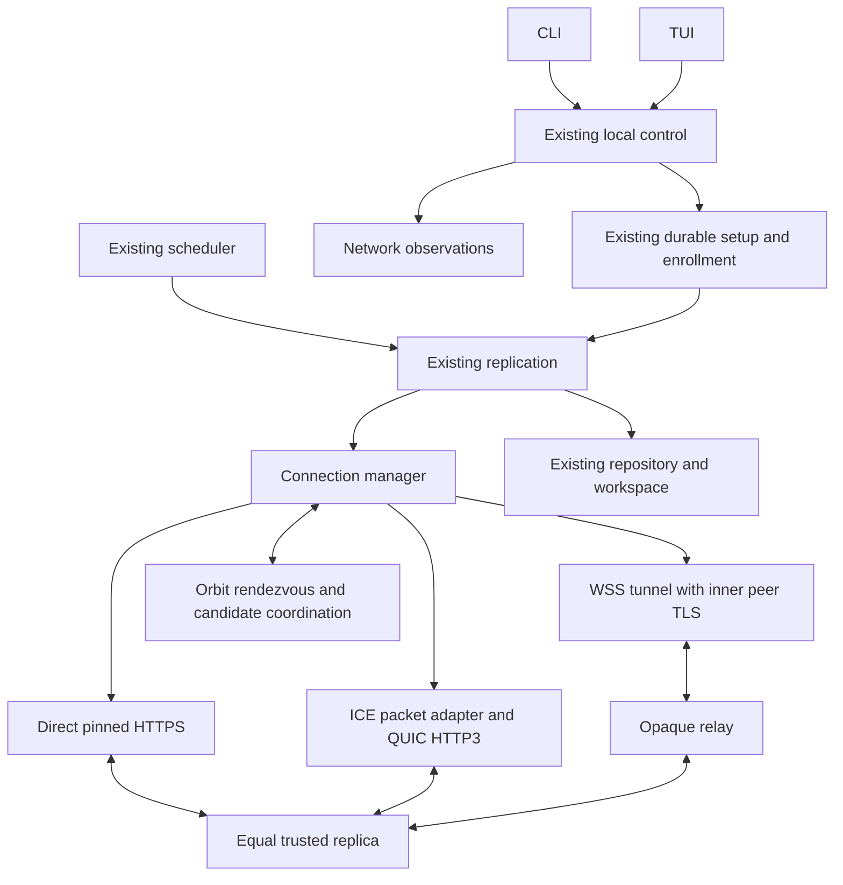

# Orbit native WAN architecture

Status: master design baseline, 2026-10-05; implementation and gate experiments
unexecuted. [Scope](portfolio-scope.md) owns product direction; [plan](orbit-wan-implementation-plan.md)
owns sequence; [network protocol](orbit-wan-protocol.md) owns network encoding,
identity and admission; [gates](orbit-wan-design-gates.md) identify required proofs.

## Shape



Default services are operated infrastructure, separate from replicas. A relay
never becomes a folder member, stores file history or issues a durable receipt.
The optional trusted VPS replica retains authorized plaintext history and supports
forwarding without overlapping end-device availability. It may share a host with
an isolated relay process, with separate credentials, ports, resource limits and
administration. Nothing changes an existing VPS workload during planning or faults.

## Deep module and interface

Create a connection manager in `internal/network`. Its small caller interface
selects a transport for a logical target and returns qualified observations;
it hides discovery caches, candidate races, relay allocation, UDP traversal,
connection lifetimes, network generations and cooldowns. Existing replication
continues to own certificate pinning, per-request membership authorization,
enrollment proofs, chunk validation and receipt semantics.

Illustrative interface; W01 freezes exact Go types and fixtures:

```go
type Target struct {
    Device DeviceID
    Pin KeyPin
    Purpose Purpose // peer data or isolated enrollment
    Bootstrap *ReviewedBootstrap // required for an unknown inviter route
}
type Manager interface {
    Transport(context.Context, Target, *tls.Config) (http.RoundTripper, error)
    Observe(DeviceID) Observation
    Close() error
}
```

Transport instances are reusable, bounded and context-cancellable. Their target
identity/pin is immutable. Replication supplies the TLS configuration; clone it
and preserve its target binding. A request's own context controls its attempt; manager
shutdown controls all work. Keep TLS configuration supplied by replication rather
than generating permissive verification inside the manager. Enrollment gets a
separate route/pool/handler set. The chosen `RoundTripper` preserves the standard
HTTP request/response and `req.TLS` properties required by existing peer handlers.
Receiving transport adapters feed only peer or enrollment HTTP servers, never
the loopback control handler. W01 must refine this interface if executable spikes
show a simpler seam that preserves these obligations.

Direct HTTPS and relayed HTTPS are real adapters at the transport seam; HTTP3
is the UDP adapter. Keep internal protocol helpers private where only one module
needs them. `history`, `repository` and `workspace` do not import traversal libraries.

| Owning module | New responsibility |
| --- | --- |
| `internal/network` | Profiles, verified candidate cache, route selection, TCP/WSS/UDP adapters, observations, bounded lifetimes |
| `internal/replication` | Existing pinned TLS, peer HTTP semantics; v3 routed enrollment and safe transport injection |
| `internal/protocol` / schemas | Canonical signed network records and enrollment v3 fixtures |
| `internal/repository` | Additive durable network settings/peer routing references and reviewed setup records |
| `internal/control`, `controlclient` | Reviewed connection settings, named network queries and setup operations |
| `internal/app`, config, launcher | One daemon, manager lifecycle, isolated listeners, configuration loading |
| `internal/scheduler` | Existing durable jobs; fair retries over manager-provided transport |
| `cmd/filesync`, `internal/terminal` | CLI/TUI adapters, contextual setup, qualified network presentation |
| proposed `cmd/orbit-net` and server implementation | Rendezvous, relay and STUN deployment; no sync repository or owner control |
| scripts/packaging | Service packages, profiles, safe local network harness and native campaigns |

A single `orbit-net` executable may expose separately configured rendezvous,
relay and STUN listeners. Keep their implementations separable for testing and
deployment. Reuse established HTTP/TLS and STUN implementations. SQLite may store
service configuration/admission records if needed; transient candidate leases and
relay sessions do not require a replicated database, Redis or Kubernetes.

## Selected transport composition

### Relay milestone

Use public HTTPS/WSS with ordinary server-certificate verification for the outer
connections. A maintained Go WebSocket library supplying a binary `net.Conn`
adapter is the default candidate (`github.com/coder/websocket`). Both devices
connect outward. The broker joins bounded byte streams; pinned device TLS and
the existing HTTPS peer/enrollment exchange run **inside** that stream. The broker
terminates outer TLS only. It receives no invitation capability or folder bytes
in readable form. Use HTTP/1.1 WSS upgrade initially; do not assume the chosen
library has HTTP/2 extended-CONNECT support.

There is a persistent authenticated control connection per configured service
and on-demand data tunnels with finite admission. Explicitly reject nonempty
browser Origin headers; library defaults can allow same-origin browser clients.
Application authentication remains mandatory. The WebSocket
stream adapter's read limit/deadline behavior must be measured: disabling a
message limit does not authorize unbounded broker buffering. Copy with fixed
buffers, bounded library configuration and backpressure; close both tunnel legs
on cancellation/error. Relay admission tokens are short-lived, role/peer/purpose
bound and separate from folder invitations.

Attachment expiry is separate from established tunnel lifetime: a 30-second
reservation must attach promptly, while an admitted active tunnel may carry
requests for up to 60 minutes within its idle/quota bounds. Then drain the active
request to its finite deadline and close; later work opens a new session and
resumes at verified chunk boundaries. Credentials cannot renew enrollment.

### Direct UDP milestone

Preferred composition: Pion ICE gathers/checks host and STUN-observed candidates;
Orbit's authenticated rendezvous exchanges candidate messages. An established
ICE pair is exposed through a **packet-preserving `net.PacketConn` adapter** to
`quic-go`; native HTTP3 uses the existing peer HTTP handlers and pinned TLS.
Pion owns UDP reads. Never have ICE and QUIC both read the same raw socket.
ICE's Conn is a packet transport, not a reliable byte stream for `tls.Client`.

Use one quic-go transport to read each established ICE packet adapter and to both
listen and dial. Both devices serve their peer HTTP3 handler and may initiate a
separate QUIC client connection; this preserves the existing independent pull
direction on each device. ICE controlling/controlled roles do not determine HTTP
client/server roles or folder authority. WG4 must prove simultaneous listen/dial
and both pull directions through the same owned packet transport.

W09/W10 must prove the versions, adapter MTU/address/deadline/close semantics,
packet ownership, TLS pinning and HTTP handler limits. QUIC 0-RTT is disabled.
Map existing header/request/body/idle deadlines explicitly to HTTP3 support and
context/reader enforcement; net/http server timeout fields do not transfer
automatically to an HTTP3 server. Freeze adapter addresses for one generation;
an ICE selected-pair change closes/rebuilds the QUIC transport rather than mutating
its advertised addresses beneath a live session.
Enrollment initially remains HTTPS/WSS; HTTP3 serves only already-authorized peer
data and membership operations. The same existing `/peer/v1` encoding remains.
Default ICE uses host/srflx candidates and STUN; the WSS relay supplies fallback,
so TURN and WebRTC are unnecessary in the first release.

If the native HTTP3 composition fails its gate, the one bounded alternative is a
raw QUIC bidirectional stream adapter carrying existing inner TLS/HTTP. Record
and measure its double-TLS, MTU, closure and resource costs before replacing the
baseline. Unsupported combinations are not silently shipped. Dependency versions
and licenses are pinned from current official source by W01/W09; today's research
does not establish a compatible installed stack.

## Connection policy

Use the same persistent device ID/key across every route. Addresses locate a
device; they never confer identity, enrollment or folder membership. Maintain a
candidate set per device, service profile and purpose, with source, verified
signature, expiration, network generation and supported transports.

Cold connection default: start at most two eligible direct attempts, start relay
after a 750-ms head start if no authenticated direct path is ready, and bound an
initial connection cycle to 10 seconds. Existing connection-level/transfer
deadlines remain finite. Continue economical direct probing during relay use
(initially once per 60 seconds with jitter). Prefer authenticated direct paths
for new requests; drain existing in-flight work up to its existing deadline.
Route changes neither create new versions nor replay mutations under new IDs.

W11 tunes these planning defaults with recorded Pi/latency experiments. Freeze
finite values and expose Advanced controls; a numerical default is a bound, not
a performance claim. At most one traversal session and two live transport pools
per peer/purpose, bounded globally. Failed candidates get exponential cooldown;
failures retain categories rather than becoming a permanently preferred cache.

Detect interface/default-route changes and explicitly bump network generation.
Refresh leases, rebuild ICE pairs and probe existing paths. Do not assume seamless
QUIC/ICE migration. Validated old requests may finish; failed requests use existing
idempotency/chunk-boundary retry behavior. Flapping cannot generate unbounded jobs,
sockets, resolver calls or goroutines. Discovery outage does not tear down a valid
existing connection; expired discovery data cannot become permanent authority.

## Candidate and infrastructure trust

Service profiles provide versioned approved HTTPS/WSS origins, STUN addresses,
operator identity, authority key, privacy text and finite expiry. Distributed
profiles are signed; self-host profiles are explicitly selected/reviewed. Normal
TLS hostname verification remains mandatory for public service origins. DNS
resolution never chooses a peer's identity. A profile update cannot change device
pins or point at loopback control. Profile rotation uses the profile authority;
legacy defaults are not silently replaced with unrelated public servers.

Public rendezvous publishes only globally routable direct candidates plus relay
availability. LAN addresses travel through local discovery or authenticated
pair coordination with interface/scope checks. Reject loopback, unspecified,
multicast, broadcast, link-local without an explicit local interface scope and
ambiguous IPv4-mapped forms. Bound DNS resolution/rebinding and use reviewed
private-origin exceptions solely for self-host/manual modes. The relay connects
two admitted outbound clients and never dials a caller-provided URL.

Rendezvous registrations bind the existing random DeviceID **and** key pin with
proof of possession. The pair is the directory key; an arbitrary key claiming
another device's ID cannot overwrite its pinned entry. Peers query with their
known pin; a bootstrap invitation supplies the inviter's pin/certificate. No
trust-on-first-use from discovery results and no re-derivation of existing IDs.

## Durable and transient state

Durable: reviewed mode/profile, explicit manual candidates, known peer ID/pin,
capabilities, setup operation/attempt/root/approval phase and v3 route bindings.
Use additive schema/config migrations under existing exclusive ownership and
atomic writes. Keep `peers.json` v1 manual endpoints importable; do not mix newly
discovered addresses into its approval semantics.

Transient: candidate leases, sockets, relay reservations, ICE passwords, network
generation and diagnostics ring. Regenerate them after restart from durable
intent. Service restart invalidates its leases/reservations and clients reannounce.
Neither directory presence nor relay buffers imply durable file storage. Never
persist invitation plaintext in discovery or telemetry; use existing private
setup storage rules when a receiver needs the original invitation to resume.

## Evidence and unresolved integrations

[Design gates](orbit-wan-design-gates.md) require executable proofs, not new scope
interviews. The selected direction is fixed; workers close exact encoding/library
and adapter decisions with evidence. The [transport research](research/orbit-wan-transport-options-2026-10-05.md)
records primary-source capabilities and unexecuted integration questions. A local
spike is not production WAN evidence. Current T13, P17 historical pilot records
and deferred owner review remain visible in their original trackers.
