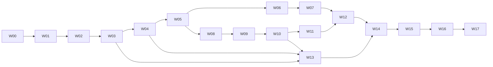

# Orbit native WAN implementation plan

Date: 2026-10-05. The owner selected native cross-network connectivity and simple
Syncthing-like setup, then confirmed **preconfigured Orbit services with optional
self-hosting**. This authorizes the planning direction. W00 baseline execution is recorded in the
[tracker](implementation/wan-status.md). W01 additive contracts and local gates are complete in
[the outcomes](implementation/wan-contracts.md); W02 implements the manual manager and records validation in the tracker;
W03 authenticated service/profile and W04 encrypted relay validation are recorded in the tracker; W05 production enrollment is recorded in the tracker; W06 CLI controls/local integration and full aggregate validation are complete; W07 keyboard TUI onboarding and local relay milestone pass focused and full aggregate validation; W08 implements scoped LAN discovery and reachable direct TCP/IPv6 with local/isolated fixture evidence; W09 integrates native QUIC HTTP3 with local transport-subgate evidence; W10 integrates authenticated ICE/STUN with full local native/emulator composition evidence; W11 route policy/roaming/fairness is complete with local native/emulator and actual Pi evidence; W12 qualified status/diagnostics/privacy controls are complete for their recorded local acceptance; W13 operator tooling, packaging, rotation and self-host rehearsal pass locally and the hosted service is live while WG6 awaits authority-key backup and alerting; W14 packaged default profile, migration, mixed versions and one-step CLI controls are implemented with final-source validation in progress; W15–W17 remain unimplemented/unexecuted; the packet definitions below
specify their required work.

## Start here

1. Inspect the working tree and [WAN status](implementation/wan-status.md).
2. Read [scope](portfolio-scope.md), [glossary](../CONTEXT.md),
   [WAN UX](orbit-wan-ux.md), [architecture](orbit-wan-architecture.md),
   [network protocol](orbit-wan-protocol.md), and [design gates](orbit-wan-design-gates.md).
3. Read the first eligible packet and its prerequisite evidence. Consult
   [protocol](protocol.md), [persistence](persistence.md), [operations](operations.md),
   and [verification](verification.md) for the behavior being changed.
4. Implement the packet through its owning modules, execute its checks, and
   record actual results. Continue eligible work without a per-packet approval ritual.

The W plan owns this expansion. T/P/O plans remain the baseline and historical
evidence; their incomplete checks remain incomplete. T13 completion is required
for the combined release, but baseline inventory, experiments and isolated W
development can proceed earlier. W00 must record which baseline checks affect
each production packet. A failing relevant prerequisite needs an owned repair
and reproduction before dependent acceptance.

## Result and five blocks

Ordinary users install Orbit, create or join a folder, exchange an invitation,
approve the device and sync across supported networks. The default connection
mode discovers routes, prefers usable direct paths and falls back to an encrypted
relay. No Tailscale installation, manual IP address, router administration or
separate service account is required for this ordinary journey. LAN-only,
manual/private-network and self-hosted modes remain explicit alternatives.

Orbit retains its own sync engine and causal/recovery semantics. This is behavioral
inspiration from Syncthing, without Syncthing wire compatibility or feature parity.
Transport libraries supply TLS, QUIC, WebSocket and ICE primitives; Orbit owns
route policy, authenticated integration, enrollment, diagnostics and synchronization.

| Block | Packets | Reviewable result |
| --- | --- | --- |
| A Foundations | W00–W02 | Honest baseline, closed initial gates, typed contracts and identity-based transport seam |
| B Relay and simple setup | W03–W07 | Reachable rendezvous/relay, first-time WAN enrollment, usable CLI and TUI setup |
| C Direct connectivity | W08–W11 | LAN/public routes, QUIC/ICE traversal, bounded fallback and network-change recovery |
| D Operations and compatibility | W12–W14 | Clear network observations, operable default services, upgrades and privacy controls |
| E Release evidence | W15–W17 | Failure/resource campaign, real networks, packaged default setup and defensible delivery |

Details: [foundations](implementation/wan-foundations.md),
[relay/setup](implementation/wan-relay.md), [direct networking](implementation/wan-direct.md),
[operations/release](implementation/wan-release.md).

## Packet dependencies

| Packet | Deliverable | Dependencies |
| --- | --- | --- |
| W00 | Baseline, provenance and reproductions | Existing repository |
| W01 | Initial security/transport gates and additive contracts | W00 |
| W02 | Connection manager and preserved direct HTTPS | W01 |
| W03 | Authenticated rendezvous, profiles and candidate leases | W01, W02 |
| W04 | Bounded encrypted WSS relay | W01, W02, W03 |
| W05 | Routed enrollment v3 and two-way peer data | W02, W03, W04 |
| W06 | Automatic CLI setup, named pairing and scripting | W05 |
| W07 | TUI onboarding and relay milestone | W06 |
| W08 | LAN discovery and reachable TCP/IPv6 candidate dialing | W02, W03, W05 |
| W09 | QUIC/HTTP3 integration gate and direct peer transport | W01, W02, W08 |
| W10 | ICE/STUN coordination and NAT traversal | W03, W04, W09 |
| W11 | Route selection, fallback, roaming and fairness | W08, W09, W10 |
| W12 | Qualified network status, diagnostics and controls | W06, W07, W11 |
| W13 | Service operations, real release profiles and self-hosting | W03, W04, W10 |
| W14 | Migration, mixed versions, packages and privacy modes | W05, W06, W07, W12, W13 |
| W15 | Integrated adversarial/failure/resource campaign | W11, W12, W13, W14 |
| W16 | Native WAN and ordinary setup campaign | W07, W11, W13, W14, W15 |
| W17 | Combined release, documentation and evidence | W00–W16, remaining relevant T13 technical checks |

The dependency table is authoritative; the diagram abbreviates it. Default work
is sequential. If parallel execution is explicitly requested, eligible W07 and
W08 can use separate presentation/network files; W12 and W13 can use separate
control/operator files. Assign ownership of shared types, app wiring, schemas,
Makefile and final integration to one worker. Tests and partial screens alone
cannot complete a packet.

## Usable milestones

| Milestone | Completion bar |
| --- | --- |
| M0 Preserved baseline | W00–W02: unchanged histories/keys, existing LAN/manual sync through the new transport seam |
| M1 WAN CLI | W03–W06: fresh devices on separate networks enroll and exchange verified bytes through relay, with resumable approval |
| M2 WAN terminal use | W07: the same journey works in the real keyboard TUI; quitting leaves synchronization running |
| M3 Automatic direct paths | W08–W11: direct connection when supported, relay on failed traversal, accurate reconnection after network changes |
| M4 Operable distribution | W12–W14: default services/profile, self-host package, stable diagnostics, migration and privacy modes |
| M5 Release | W15–W17: tested packaged defaults on declared real networks, combined baseline checks and measured limits |

M1/M2 precede full traversal. A working relay does not complete the direct-path
milestone. A simulation does not complete native WAN acceptance. The hosted
default is complete only with an actual operator, reachable endpoints and current
profile evidence; example domains or a locally overridden test server do not qualify.

## Architect and workers

The master architect owns product flow, module interfaces, contract ownership,
sequence and material design revisions. **6.1 Sol Medium and 3.8 Flash High may
each implement any eligible packet**, including security, transport, persistence,
CLI/TUI and verification. Use the same acceptance bar for both. Model assignment
is a handoff choice, not an architecture or module split.

Workers execute routine reversible decisions and gate experiments within this
plan. A gate record must include the selected implementation, executable evidence,
updated owning specification and limitations before its dependent code is accepted.
Bring a material scope/guarantee change to the owner with a concrete proposed
revision. An unavailable architect session does not block ordinary implementation.

### Worker kickoff

> Read AGENTS.md and docs/orbit-wan-implementation-plan.md, then
> docs/implementation/wan-status.md. Implement the first eligible W packet
> (initially W00), reading its prerequisite evidence, UX, architecture, network
> protocol, gates and relevant owning specifications. Preserve the existing dirty
> tree, P/O/T evidence, device identities, causal histories and deferred P17 owner
> use/explanation work. Use disposable marked environments for faults. Implement
> and integrate the production behavior, execute acceptance checks, and record
> commands/results, provenance and limitations. Continue eligible work without
> per-packet permission; finish with the precise next packet and resumable handoff.

### Bounded assignment

> Implement [eligible W packet or named slice] in [owned files]. Deliver the
> packet's production integration and specified evidence. Keep shared contracts
> in their owning modules. Record unexecuted checks explicitly. A partial slice
> leaves its packet incomplete. Either worker model follows the same contract.

## Validation and completion

I01–I28 remain authoritative; [WAN invariants](verification.md#native-wan-verification)
add N01–N10. Discover actual tests before running a planned `TestWANWXX` group;
zero matched tests mean unexecuted coverage. Typical discovery is
`go test -list '^TestWANWXX' ./internal/... ./tests/... ./cmd/filesync/...`.
Record the discovered packages, then run their tests with `-count=1` and the
appropriate race/PTY/process checks. Planned runner names must be delivered and
documented before being reported as available.

Run focused checks at each packet. Use `make check` at integrated milestones;
full uncached race, demo, packages and the relevant model/fault campaign at W15/W17.
Explicitly include CLI tests when the current Makefile omits them. Do not rerun
irrelevant expensive campaigns without a new concern. Run documentation-link and
contract-fixture checks when contracts change.

Evidence lives in `docs/evidence/wan-wXX-<run-id>/`: `manifest.json` (revision,
dirty/snapshot provenance, dependencies, hosts, network and filesystem assumptions),
`commands.md`, `results.json`, `summary.md` and sanitized transcripts/metrics.
Record NAT emulator configuration and the distinction between simulated and real
networks. Preserve minimized failures and all unsupported/unexecuted cases.

Complete a packet only when every acceptance item has evidence. Complete W17
only when the dependency table, profile/operator readiness, security/resource
limits, native network cases and inherited release conditions are satisfied.
Owner personal use and unaided explanation stay deferred under the 2026-10-04
amendment; retain their historical records.

## Scope boundaries

The first WAN release includes WSS relay, discovery/rendezvous, direct TCP/IPv6,
QUIC with ICE/STUN, roaming, simple terminal setup and self-hosted operation.
UPnP/NAT-PMP/PCP router mappings, TURN, WebRTC, arbitrary proxy support, public
relay federation, mobile platforms and Syncthing interoperability are future
extensions rather than hidden acceptance requirements. These can be evaluated
after measured direct/relay results. Restrictive networks can still block every
supported route; no universal network success guarantee or free indefinite
hosting commitment is created by this plan.
